# Lectern

<p align="center">
  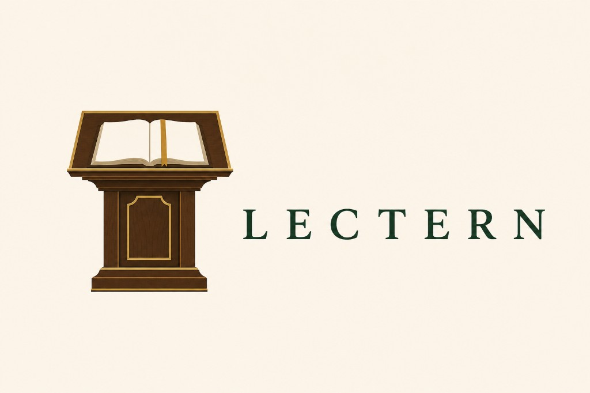
</p>

**Live URL:** [https://lectern.click](https://lectern.click) · studio: [https://lectern.click/studio](https://lectern.click/studio)

Lectern helps teachers share knowledge more efficiently with web-MCP AI.

Bring the files you already have. Draft in the studio. A WebMCP agent writes the rest **into that same page**. You review. Then export a PDF for students and a `.lectern` file to keep writing. Students: upload PDF → read-only → annotate → ask AI (web-MCP).

<p align="center">
  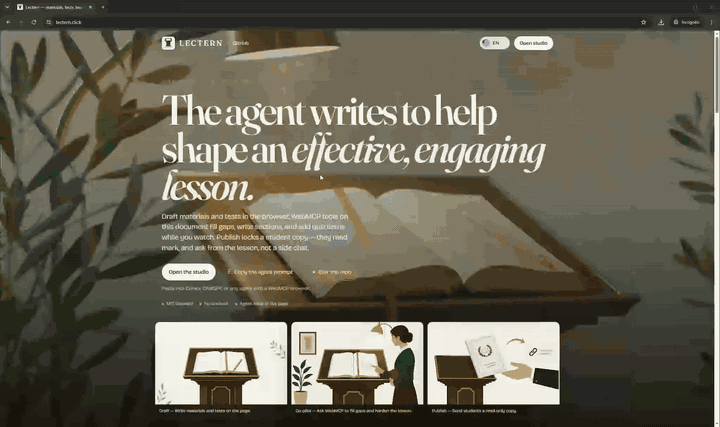
</p>

---

## WebMCP-first (this is the product)

Lectern is an **in-page MCP server**. The open document registers typed tools on `document.modelContext` (fallback: `navigator.modelContext`) so ChatGPT’s in-app browser — or Chrome with WebMCP enabled — can author and tutor *inside* the same UI the human sees.

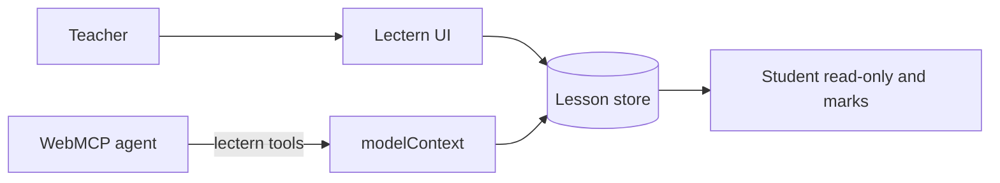
| Mode | What the agent can do |
| --- | --- |
| **Teacher** | `lectern_list_gaps`, `lectern_upsert_section`, `lectern_upsert_quiz_item`, `lectern_publish_lesson`, … |
| **Student** | `lectern_get_section`, `lectern_add_annotation`, `lectern_list_annotations`, … |
| **Shared** | `lectern_get_lesson`, `lectern_set_mode` |

### Judge access

1. Open **https://lectern.click/studio**
2. Use **ChatGPT’s in-app browser** (WebMCP out of the box), **Cursor’s agent browser**, **or** Chrome with `chrome://flags/#enable-webmcp-testing`
3. Confirm the banner shows `WebMCP · N tools`
4. Sketch a topic (or attach the notes you already teach from) and ask the agent to complete the lesson **on the page**

Full tool catalog, sequences, and agent loops → **[docs/architecture/webmcp.md](./docs/architecture/webmcp.md)**

---

## Feature highlights

### Lectern landing page

Public home on [lectern.click](https://lectern.click): open source, in-page WebMCP, and a path into the studio.

<p align="center">
  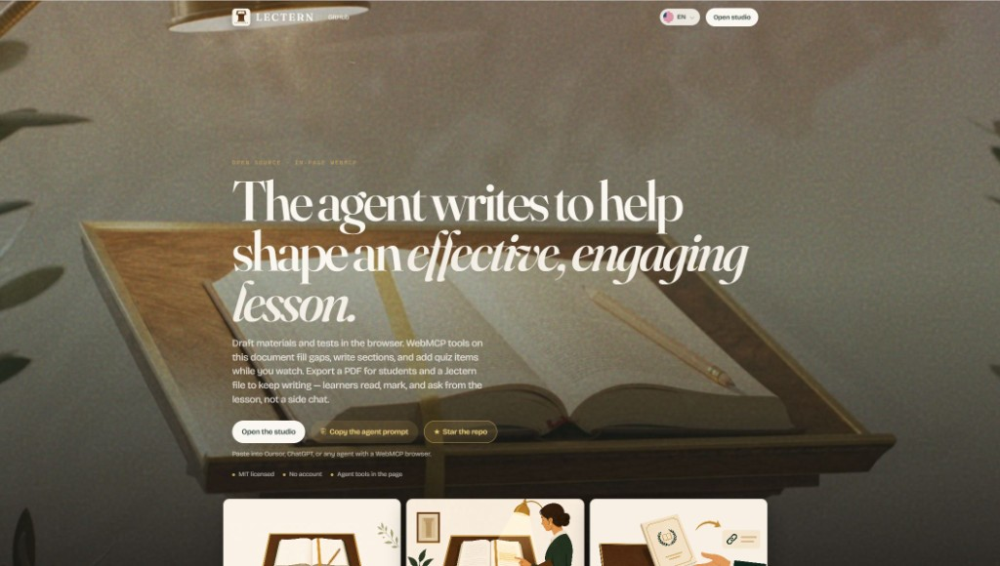
</p>

### Lectern Studio

Teacher start screen: begin a lesson, load a demo, copy the agent prompt, and open materials already on this device.

<p align="center">
  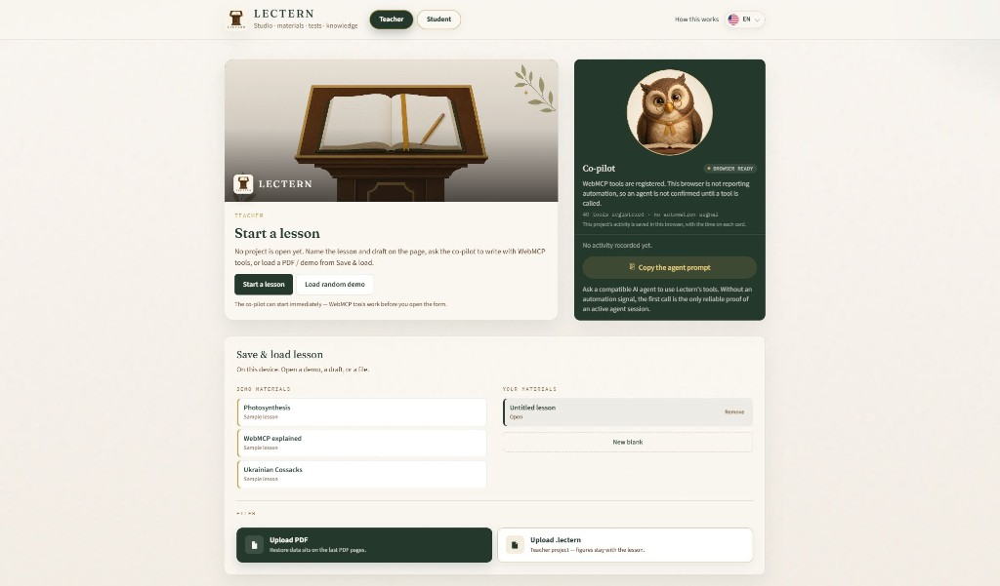
</p>

### Lesson crafted via user and agent using WebMCP

The manuscript, AI figure, nested check, and co-pilot history share one page. The checklist is complete when title, goals, materials, and tests are done.

<p align="center">
  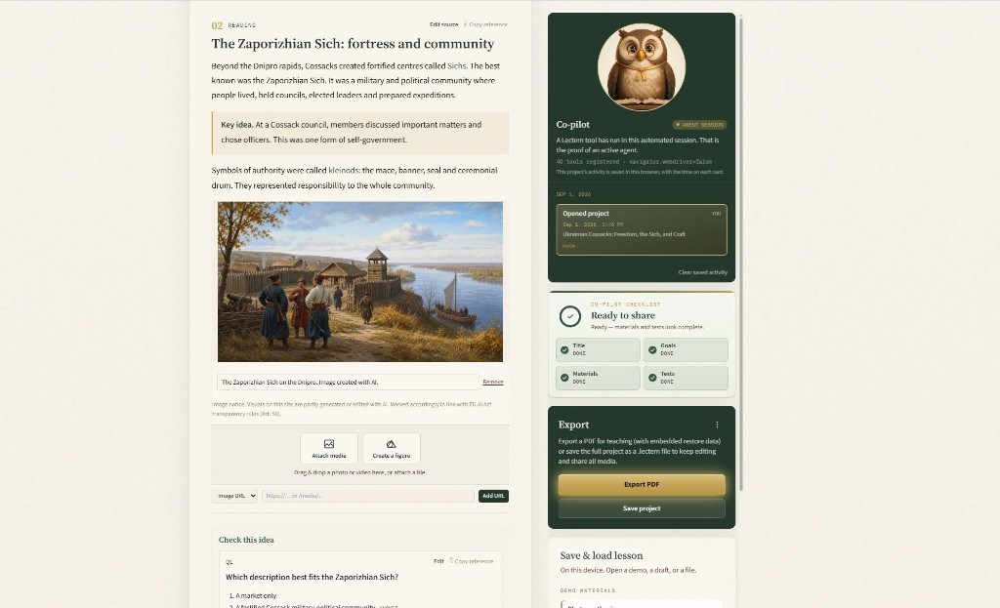
</p>

### Double-click a word to edit Markdown from that place

Select a span in the manuscript and send that phrase to the agent — no scrape, no paste of the whole section.

<p align="center">
  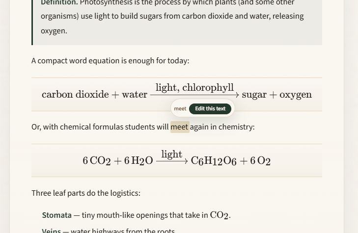
</p>

### Markdown and LaTeX in the lesson

Worked examples render bold, lists, and math (`r(I)`, saturating models) the same way they will in the student PDF.

<p align="center">
  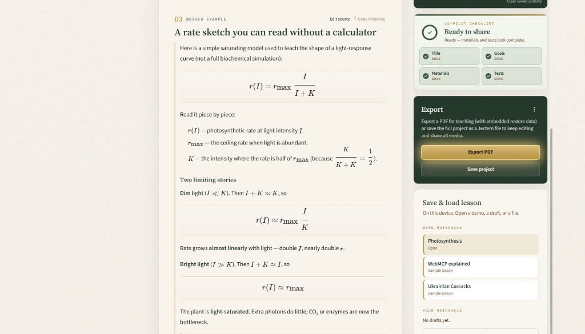
</p>

### Figure templates for the user and the agent

Catalog templates (cycle, curve, greenhouse, …) preview on the page. The agent uses `lectern_list_media_templates` and `lectern_generate_section_media`.

<p align="center">
  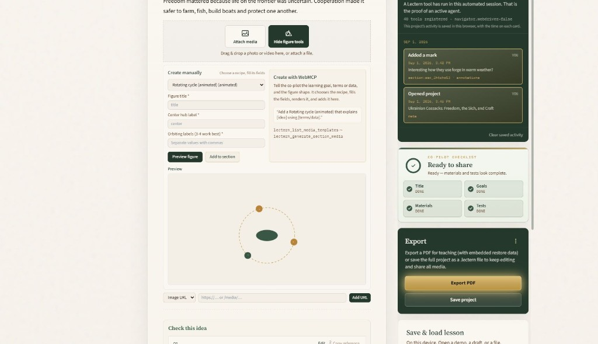
</p>

### Quiz with generated media as answer options

Visual checks: four AI-labeled cards (tongs, quill, brush, compass) as selectable answers, not text-only MCQ.

<p align="center">
  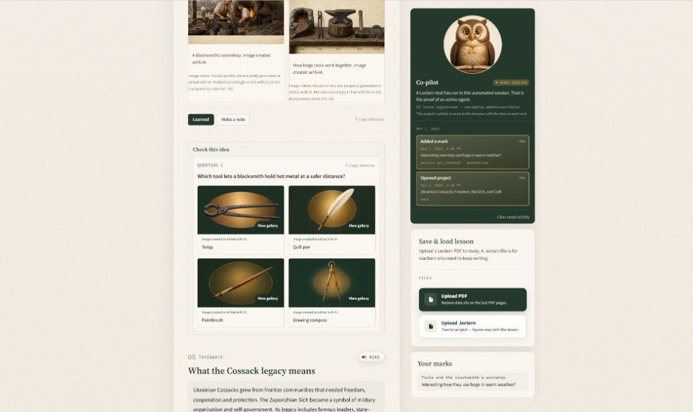
</p>

### Exported PDF as a standalone handout (and restore)

The student PDF prints as a lesson. Restore data sits in the file so the same PDF can be uploaded back to lectern.click.

<p align="center">
  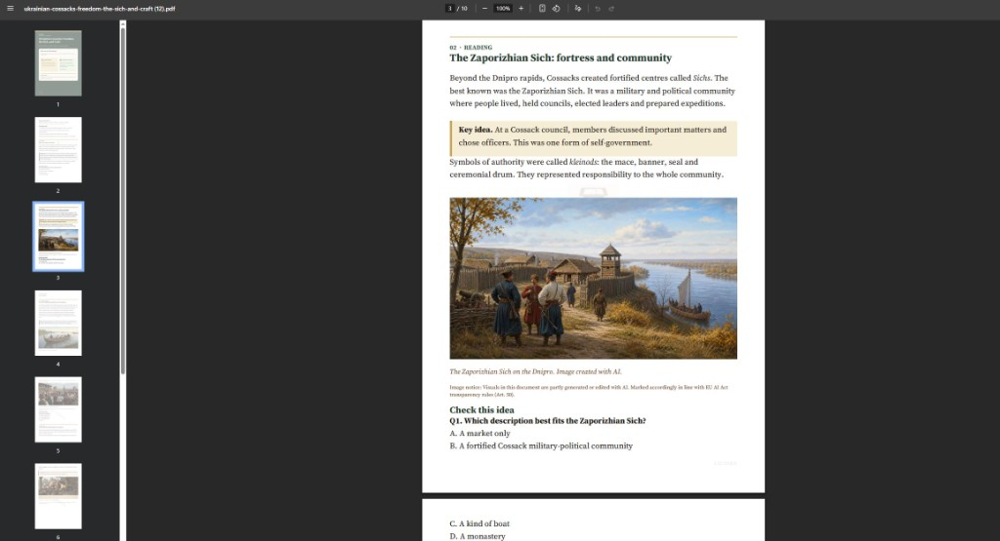
</p>

### Landscape PDF for LinkedIn and other social media

Export menu: portrait handout, or landscape for a wide figure-first share.

<p align="center">
  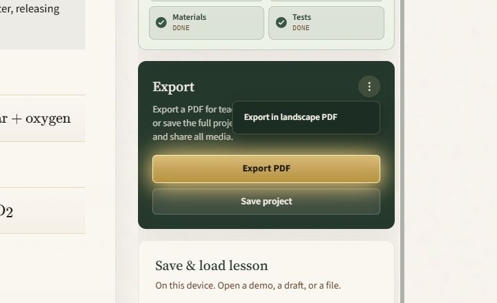
</p>

### Lectern WebMCP toolbox

Forty tools registered on the page (`lectern_list_gaps`, `lectern_offer_media`, `lectern_compress_media`, …). The catalog unregisters when you switch Teacher ↔ Student.

<p align="center">
  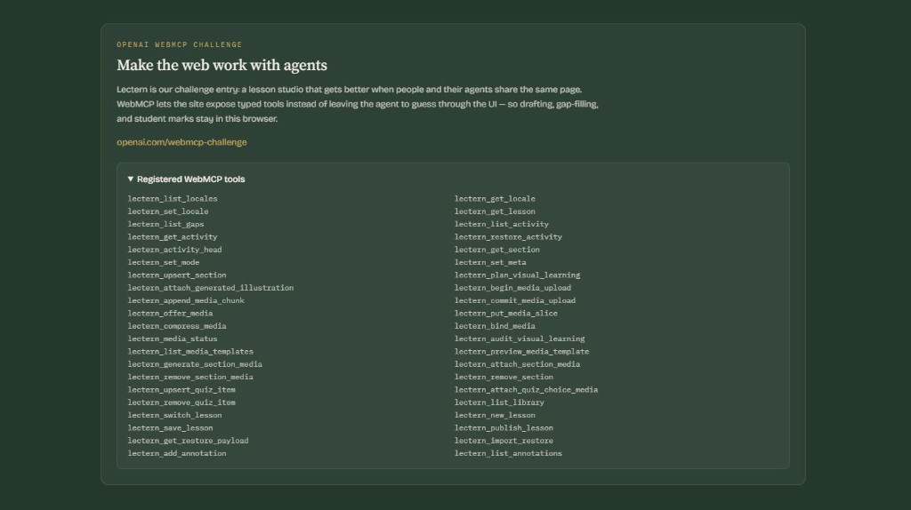
</p>

---

## Documentation

| Doc | Contents |
| --- | --- |
| [docs/README.md](./docs/README.md) | Doc index |
| [docs/architecture/C4-MODEL.md](./docs/architecture/C4-MODEL.md) | C4 Context → Containers → Components → Deployment |
| [docs/architecture/webmcp.md](./docs/architecture/webmcp.md) | WebMCP feature design (deep) |
| [docs/architecture/amdp.md](./docs/architecture/amdp.md) | AMDP — cite → intake → bind for agent rasters/video |
| [docs/architecture/AMDP-PROTOCOL.md](./docs/architecture/AMDP-PROTOCOL.md) | AMDP/1 spec |
| [docs/architecture/section-checks.md](./docs/architecture/section-checks.md) | Nested section checks + inverted PDF answer key |
| [docs/architecture/student-results-pdf.md](./docs/architecture/student-results-pdf.md) | Student→teacher results PDF |
| [evals/README.md](./evals/README.md) | WebMCP evaluation pipeline (Chrome evals) |
| [docs/architecture/flows.md](./docs/architecture/flows.md) | Mermaid flows: export PDF/.lectern, registration, data model |

---

## Local development

```bash
npm install
npm run dev
```

App: http://localhost:5180  
(WebMCP still needs a capable client + preferably HTTPS for full tool demos.)

```bash
npm run build
npm run preview
```

## WebMCP evals

Lectern ships the evaluation pipeline Chrome describes in [Evals for WebMCP](https://developer.chrome.com/docs/ai/webmcp/evals): isolation `expectedCall` fixtures, deterministic tool-logic tests, end-to-end journeys, and mid-chain failure cases. Details: **[evals/README.md](./evals/README.md)**.

```bash
npm test                 # deterministic evals + PDF restore
npm run test:evals       # catalog, schemas, fixtures, publish gate
npm run eval:local       # optional LLM evals (GOOGLE_AI / OPENAI_API_KEY / ANTHROPIC_API_KEY)
npm run eval:browser     # optional LLM evals against https://lectern.click
```

CI runs `npm run test:evals` on every Lectern build. Probabilistic evals stay opt-in (they need a model).

## License

Lectern is **open source** under the [MIT License](./LICENSE). Lectern Cloud is a separate paid product built on top (school brand, hosted PDF rendering, watermark-free export). See [LICENSING.md](./LICENSING.md).

## Deploy

**Live site:** [https://lectern.click](https://lectern.click)

Optional build arg: `VITE_SITE_URL=https://lectern.click` (default in the Dockerfile).

**Local Docker smoke:**

```bash
docker compose up --build
curl http://localhost:8080/health
curl -sI http://localhost:8080/license
```

**Rollback:** keep [`vercel.json`](./vercel.json) SPA rewrite; point DNS back to Vercel if needed.

## Agent prompts to try

**Teacher**

- “Call `lectern_list_gaps` and fix every blocker.”
- “Expand the opening section into textbook-quality prose, then add one quiz item.”
- “Publish the lesson, then export the PDF for students.”
- Paste **Copy reference** from a material, then: “Expand this section on the page.”
- Paste **Copy reference** from Q1, then: “Tighten this check.”

**Student**

- “Read section `<id>` with `lectern_get_section` and explain it more simply.”
- Paste **Copy reference** from a material, then: “Explain this more simply.”
- Paste **Copy reference** from Q1, then: “Help me reason without giving the answer.”
- “Add an annotation on that section: I’m unsure about light saturation.”
