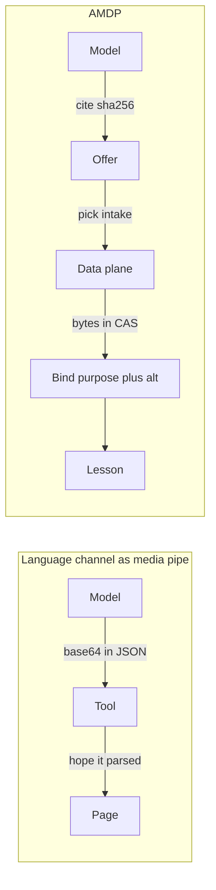
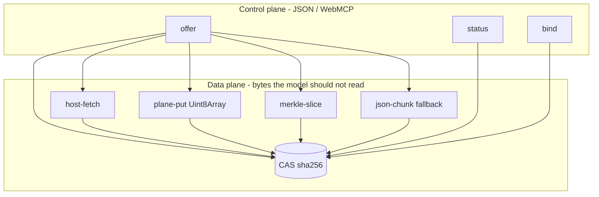
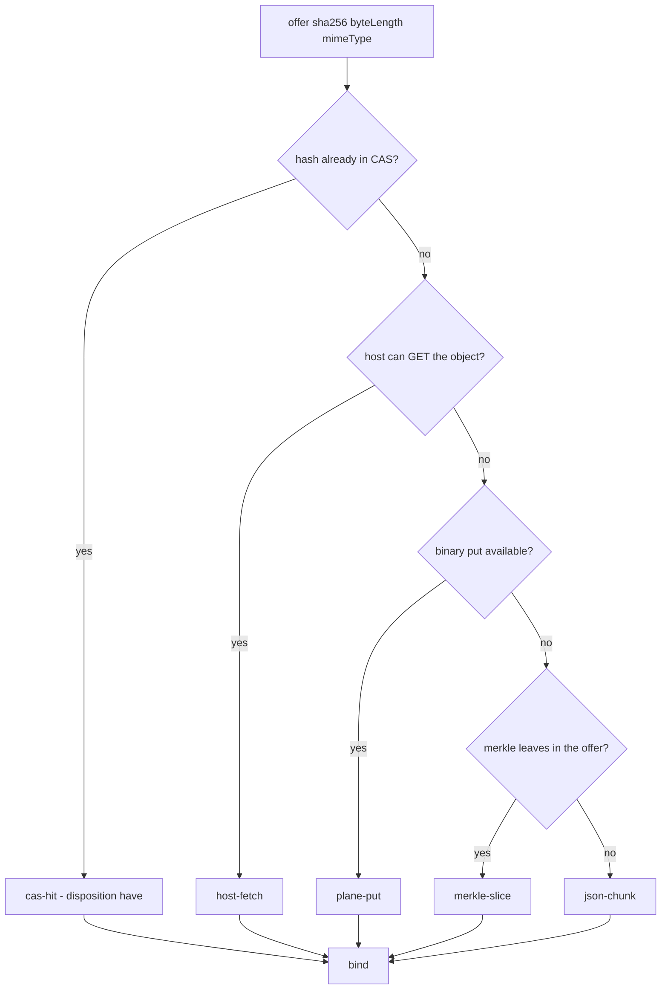
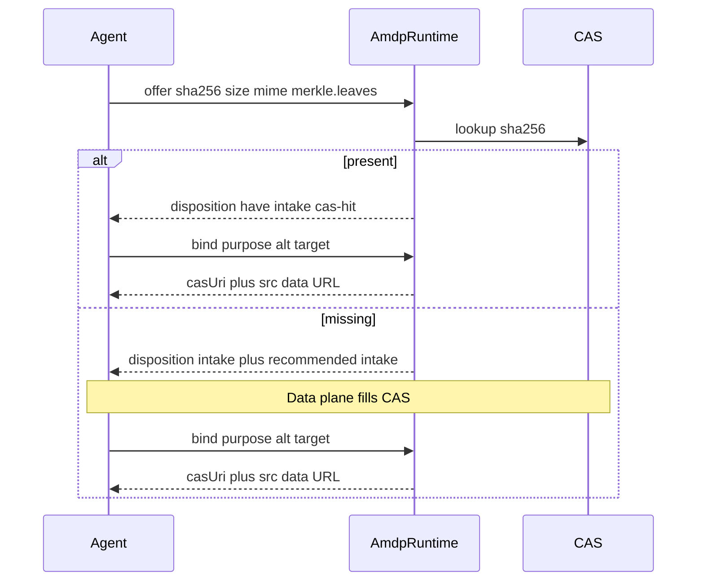
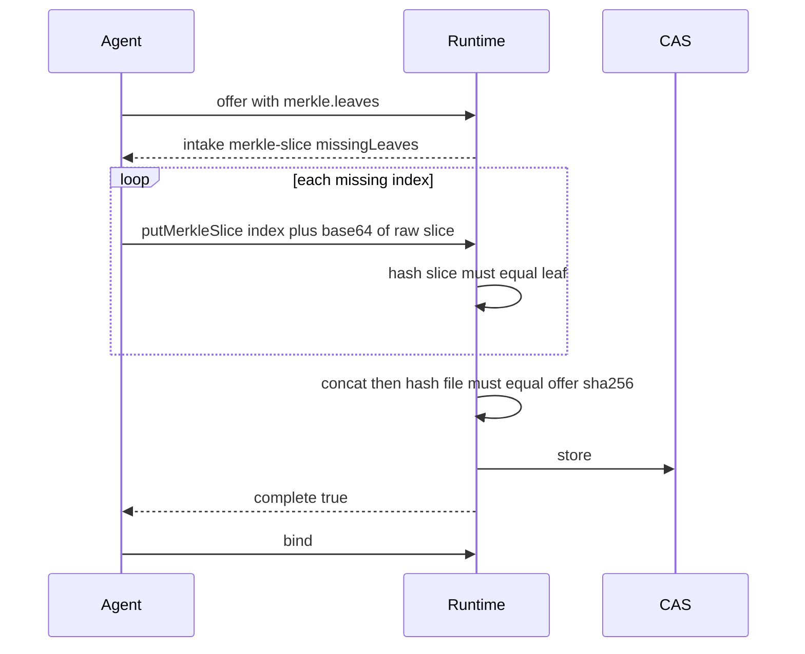
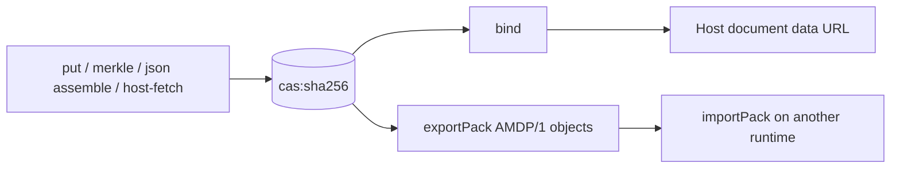

# AMDP/1 — Agent Media Description Protocol

**Cite, then bind. Never put pixels on the language channel unless every stronger intake has failed.**

Protocol id: `AMDP/1`. This is the spec. Lectern inlines the TypeScript runtime at `src/lib/amdp/` — see [Lectern AMDP](./amdp.md).

---

## The problem AMDP is for

WebMCP `executeTool` is a JSON string. MCP servers still inline images as base64. Agent computer-use stacks shove screenshots into the model context. None of those are a **media plane**.

Pixels on the language channel are the wrong ACI:

- **Cost** — a 40 KB JPEG is ~53 KB of base64; sixteen quiz cards is a sitting of tax, not teaching.
- **Integrity** — a language model (or a CDP expression the model copied) will silently mutate a 10k base64 blob. There is no leaf hash to catch it.
- **Reuse** — the same castle illustration cited twice should cost zero the second time. A data-URL tool call cannot say “you already have this.”
- **Future** — native `Blob` / `ImageBitmapSource` on WebMCP will arrive. A protocol that *is* “append base64 until commit” cannot grow into that. A protocol that is **offer → intake → bind** can.

AMDP is the split WebRTC already made obvious: SDP is not RTP. The model cites a file; the page stores bytes; bind attaches meaning.

---

## Why this is cutting-edge

Not because content addressing or Merkle trees are new — Git, IPFS, OCI layers, and BitTorrent already proved those. What is new is applying that stack to **in-page agent tools** while the web’s agent API is still JSON-only.

| Today’s default | AMDP |
| --- | --- |
| Tool arguments *are* the file | Tool arguments *cite* the file (`sha256`, size, mime) |
| One opaque base64 blob | Ranked intakes; json-chunk is last, not first |
| Repeat send = repeat tax | `cas-hit` — same hash, zero transfer |
| Corruption is invisible | Per-slice SHA-256 leaves; assemble only when the file hash matches |
| Upload server or hope for Blobs | Works in a static SPA; host-fetch / `plane-put` plug in when the browser grows a binary plane |
| “Attach this string” | **Bind** is semantic: purpose, alt, caption, target (section / quiz choice) |

That is the same direction as:

- [MCP discussion on binary / image payloads](https://github.com/modelcontextprotocol/modelcontextprotocol/issues/155) — pixels do not belong in the RPC text.
- SWE-agent and related ACI work — the action space should name *operations*, not dump bytes.
- IETF resumable upload / [tus](https://tus.io/) — integrity and resume, not one giant POST.
- WebRTC — negotiate first, move media on a side channel.

AMDP is small enough to inline in a lesson studio, strict enough to resume a 83-slice Merkle intake without the model ever seeing a JPEG, and stable enough that tomorrow’s `Blob` tool argument is just `plane-put` under the same offer/bind.

---

## Planes

- **Control plane** — `AMDP/1` offer, answer, status, bind. Fits WebMCP today.
- **Data plane** — CAS (memory, optional OPFS), host GET, Merkle slices, json-chunk. The runtime picks the cheapest intake the host can actually finish.

---

## Intake rank

Lower rank is cheaper. The answer lists `available[]` and one recommended `intake`.

| Rank | Intake | Bytes on the language channel |
| --- | --- | --- |
| 0 | `cas-hit` | none |
| 1 | `host-fetch` | none (page GET, service worker, CDP Fetch.fulfill) |
| 2 | `plane-put` | none (`runtime.put(Uint8Array)` / future native Blob) |
| 3 | `merkle-slice` | one verified slice at a time |
| 4 | `json-chunk` | base64 in JSON (WebMCP / CDP last resort) |

`agentChannel: 'json'` (Lectern default) recommends merkle-slice or json-chunk so a WebMCP agent can finish without a binary host. `agentChannel: 'binary'` prefers host-fetch / plane-put.

---

## Offer → answer → bind

Bind never accepts raw pixels. If the hash is not in CAS, bind fails. That is the whole point: **description and attachment are separate from transfer**.

### Offer (control)

| Field | Role |
| --- | --- |
| `sha256` | 64 lowercase hex of the **raw file bytes** |
| `byteLength` | Exact size |
| `mimeType` | Raster or video (hosts may reject SVG) |
| `merkle.chunkSize` / `merkle.leaves` | Optional. Enables merkle-slice intake |
| `filename` / `width` / `height` / `provenance` | Optional metadata |

### Answer

| Field | Role |
| --- | --- |
| `protocol` | `AMDP/1` |
| `disposition` | `have` or `intake` |
| `intake` | Recommended path |
| `available` | What this runtime can do |
| `missingLeaves` | If a Merkle session is already open |

### Bind

| Field | Role |
| --- | --- |
| `sha256` | Must already be in CAS |
| `purpose` | Host-defined (`illustration`, `section`, `quiz-choice`, …) |
| `alt` | Required accessible description |
| `caption` | Optional learner-facing line |
| `target` | Host-defined (section id, quiz id + choice index) |

Result includes `casUri` (`cas:sha256:…`) and a `src` data URL the host may persist onto a document.

---

## Merkle-slice intake

Leaves are SHA-256 of each raw slice (not of base64). Default slice size in the library is 65536 bytes; a host may offer a smaller size so one slice fits a JSON/CDP budget.

Resume is free: `status(sha256)` returns `missingLeaves`. Re-offer with the same leaves reopens the session. A wrong slice is rejected before it poisons the file.

---

## json-chunk fallback

When the agent cannot merkle and cannot put bytes, `begin` → `append` → `assemble` joins base64 on the page, hashes the decoded bytes, and stores them in the same CAS. Bind (or a host commit that writes a data URL) follows. This is **intake rank 4**, kept so today’s WebMCP still works — not the protocol’s idea of success.

---

## CAS and packs

- Live index is in-memory. Optional `host.persist` / `host.load` (OPFS).
- `exportPack` / `importPack` snapshot objects for document restore (Lectern LCT1-style).
- URI scheme: `cas:sha256:` + hex.

---

## What AMDP is not

- Not a CDN and not an upload API with accounts.
- Not a replacement for SVG *generation* on the page (Lectern keeps templates for schematics).
- Not “store blobs in IndexedDB and hope the PDF sees them.” Bind’s `src` is what the host persists onto the lesson.

---

## Versioning

Bump `AMDP_PROTOCOL` when offer/answer/bind shapes change. Additive optional fields may land in `AMDP/1` if old runtimes can ignore them.
