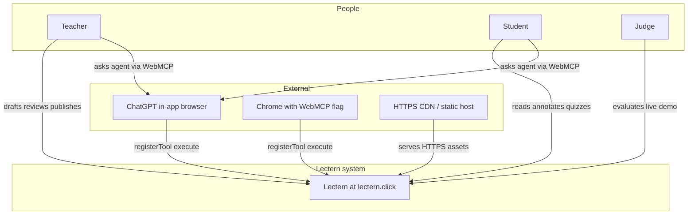
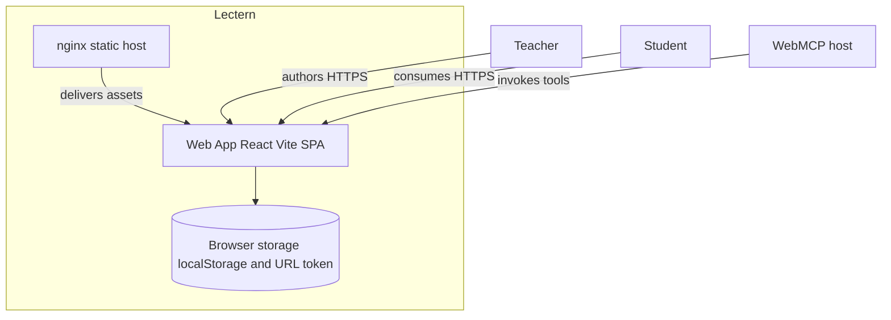
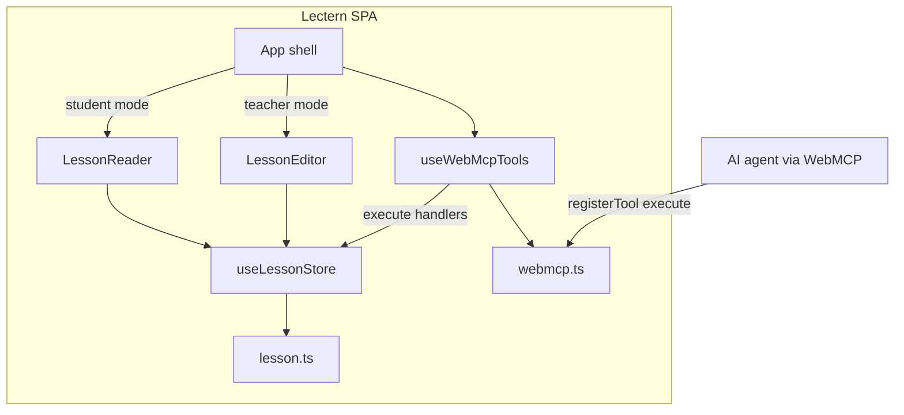
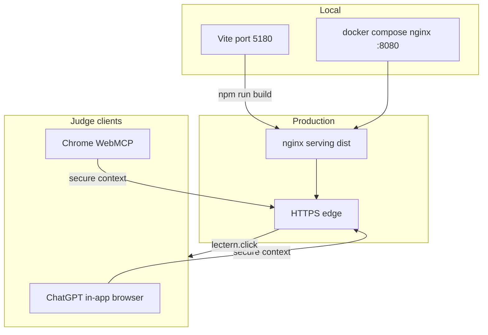
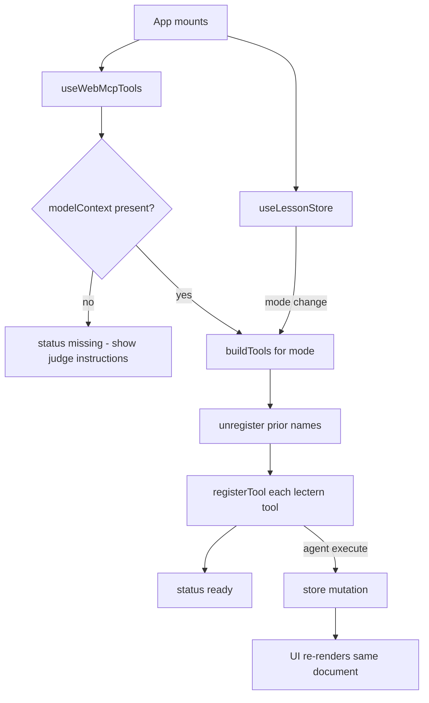

# Lectern — C4 Architecture Model

This document describes Lectern using the C4 model
(Context → Containers → Components → Deployment).

Diagrams use portable Mermaid (`flowchart` / `sequenceDiagram`) so they render on GitHub, Devpost, and most Markdown previews. (Native `C4Context` / `C4Container` blocks are omitted — many renderers do not support them.)

Lectern is a **WebMCP-native** lesson studio: the browser page is the MCP tool surface.
Agents (ChatGPT in-app browser, Chrome with WebMCP enabled) call typed tools on
`document.modelContext` instead of scraping the DOM.

---

## Level 1 — System Context

Key context decisions:

- **No agent backend required for MVP.** Tools execute client-side against the in-memory / `localStorage` lesson document.
- **WebMCP is the product surface.** Human UI and agent tools mutate the *same* lesson store — transparent pair-writing.
- **Judges need a public HTTPS URL** (`lectern.click`) because WebMCP requires a secure context. Production is static HTTPS hosting (Vercel remains a rollback path).

---

## Level 2 — Containers

| Container | Tech | Notes |
| --- | --- | --- |
| Web App | React 19, Vite, TypeScript strict, Tailwind | Port **5180** in dev |
| Static hosting | nginx + HTTPS | Production: `https://lectern.click`. Vercel `vercel.json` kept as rollback. |
| Browser storage | `localStorage` key `lectern.lesson.v1` | Share path encodes lesson in query (`?mode=student&l=...`) |

---

## Level 3 — Components (Web App)

### Component map

| Component | Path | Responsibility |
| --- | --- | --- |
| `App` | `src/App.tsx` | Wires store + WebMCP + mode UI |
| `SiteChrome` | `src/components/SiteChrome.tsx` | Brand, Teacher/Student toggle, WebMCP label |
| `LessonEditor` | `src/components/LessonEditor.tsx` | Author materials and tests; publish panel |
| `ExportOptionsMenu` | `src/components/ExportOptionsMenu.tsx` | Landscape PDF export option |
| `InlineEditChip` | `src/components/InlineEditChip.tsx` | Select manuscript text and send that span to the agent |
| `DocumentHead` | `src/components/DocumentHead.tsx` | Canonical, Open Graph, JSON-LD for crawlable routes |
| `LessonReader` | `src/components/LessonReader.tsx` | Read-only + annotations + quiz |
| `CopySectionReferenceButton` | `src/components/CopySectionReferenceButton.tsx` | Copy a `LECTERN_SECTION` pointer so the agent can call `lectern_get_section` |
| `CopilotActivityCard` | `src/components/CopilotActivityCard.tsx` | Copilot timeline, restore, AMDP/json-chunk folds |
| `amdp` | `src/lib/amdp/` | Cite → intake → bind for agent rasters and video |
| `image-compress` | `src/lib/image-compress.ts` | Downscale/JPEG rasters before bind (`lectern_compress_media`) |
| `useLessonStore` | `src/hooks/useLessonStore.ts` | Lesson document state machine |
| `useWebMcpTools` | `src/hooks/useWebMcpTools.ts` | **WebMCP tool catalog and lifecycle** |
| `webmcp-catalog` | `src/lib/webmcp-catalog.ts` | Names, descriptions, schemas for evals |
| `webmcp` | `src/lib/webmcp.ts` | Imperative WebMCP helpers |
| `lesson` | `src/lib/lesson.ts` | Domain model helpers, readiness gaps |
| Evals | `evals/` | Chrome-style `expectedCall` pipeline |

---

## Level 4 — Deployment

### Deployment constraints (WebMCP)

1. **HTTPS required** (Secure Context) for `document.modelContext`.
2. Judges must use a **WebMCP-capable** client; plain browsers without the flag will show “WebMCP unavailable” but the human UI still works.
3. SPA fallback: nginx `try_files … /index.html` (same role as `vercel.json` rewrites). Legal routes `/license`, `/privacy`, `/terms`, `/cookies` are client-side only.
4. Production serves the Vite `dist` bundle over HTTPS at `lectern.click`.

---

## Code-level sketch (tool registration)

See [webmcp.md](./webmcp.md) for the full tool catalog and agent loops.
