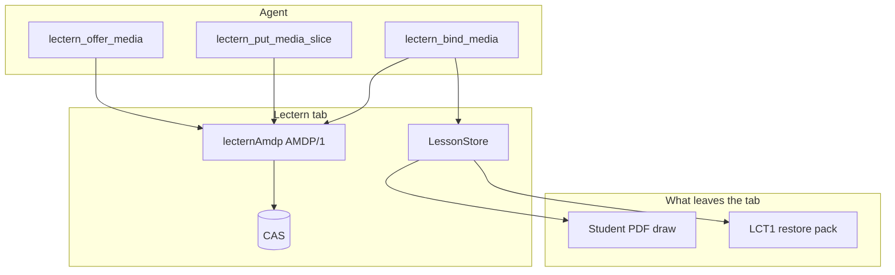
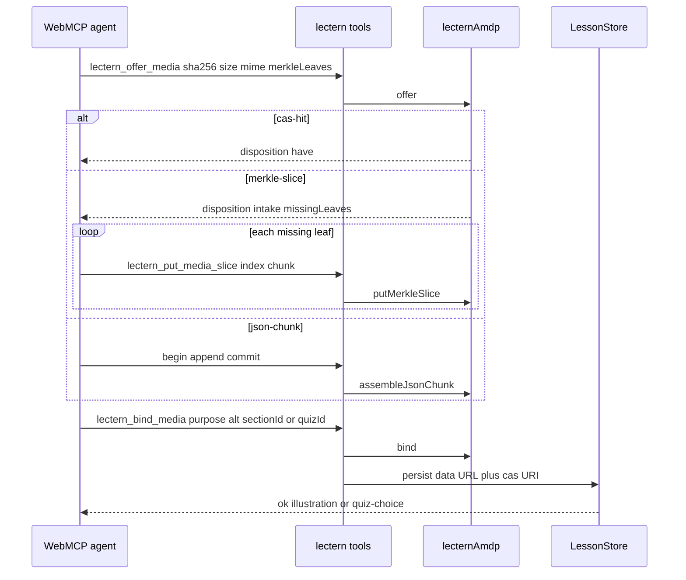
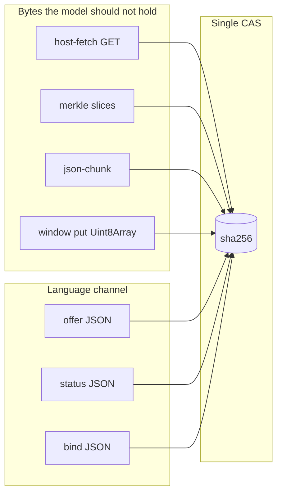
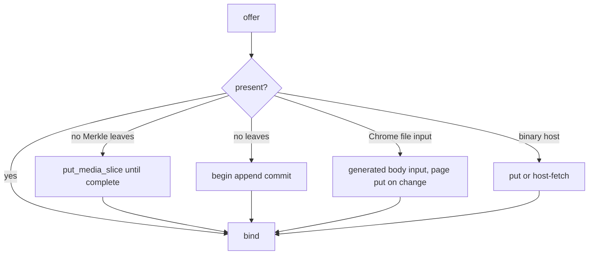
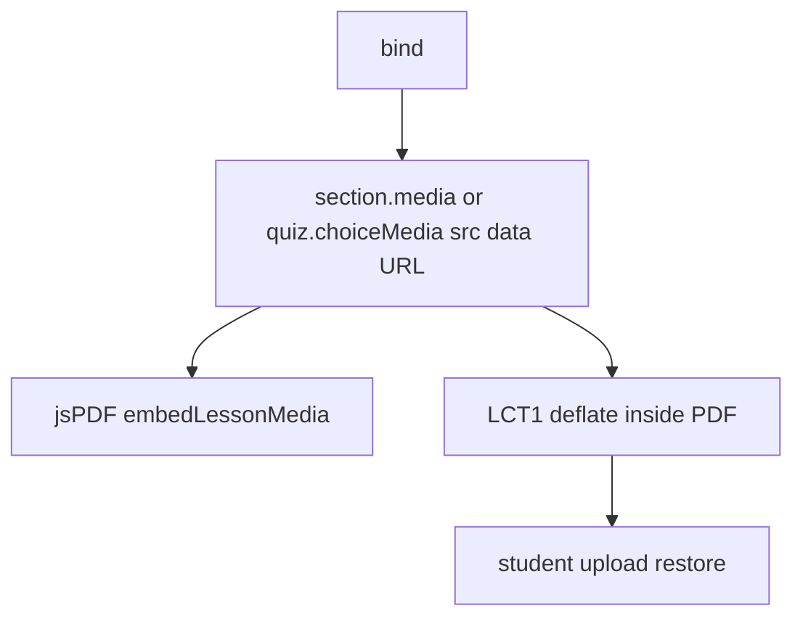

# Lectern × AMDP — Cite, intake, bind

Companion to the protocol spec: **[AMDP/1](./AMDP-PROTOCOL.md)**. Lectern inlines the runtime at `src/lib/amdp/`. Studio tools wrap it on WebMCP.

This is how an agent puts **photographs and video** onto a live lesson without treating the language model as a file pipe.

---

## Why Lectern needed a protocol, not another chunk tool

WebMCP execute is JSON. A 30–80k character data URL often cannot travel in one tool call. The path that first worked in the studio — `lectern_begin_media_upload` → `append` → `commit` — still puts pixels where they do not belong (in the model’s context), pays a base64 tax, and cannot say “this tab already has that hash.”

AMDP is the product rule (default for every agent, including a fresh Copied prompt):

1. **Cite** — `lectern_offer_media` sends `sha256`, size, mime (optional Merkle leaves). No pixels.
2. **Intake** — the page fills a content-addressed store (CAS) by the cheapest path it can finish.
3. **Bind** — `lectern_bind_media` attaches purpose + alt onto the **same lesson document** the teacher sees.

Commit/bind write a `data:` URL onto the lesson so `embedLessonMedia` can draw the figure in the exported PDF and LCT1 can restore it. Do not keep agent media only in IndexedDB.

SVG schematics stay on `lectern_generate_section_media`. AMDP rejects `image/svg+xml` — rasters and video only.

---

## Why this is cutting-edge in a lesson studio

Lectern is a **static HTTPS SPA**. There is no media upload backend. The page *is* the MCP server. That combination is unusual, and it makes the default “POST the file” design illegal.

AMDP is cutting-edge here because it treats that constraint as the architecture, not a workaround:

| Constraint | Naive agent media | AMDP on Lectern |
| --- | --- | --- |
| WebMCP is JSON | Stuff a data URL into `executeTool` | Offer cites a hash; intake is ranked |
| Model copies 10k base64 | Silent corruption | Merkle leaf per slice; file hash at assemble |
| Same figure twice | Send it twice | `cas-hit` → bind with zero transfer |
| No PUT server | Invent a sidecar the teacher must run | Optional `host-fetch`; merkle/json still finish in-tab |
| Native Blobs not in WebMCP yet | Wait, or keep chunking forever | `plane-put` is already the slot; json-chunk is rank 4 |
| Lesson must travel | IndexedDB ghost files | Bind writes the data URL the PDF already knows how to draw |

Same direction as MCP’s binary-payload discussion, tus-style resume, and WebRTC’s control/media split — applied to **pair-writing a manuscript** in ChatGPT’s browser or Chrome with WebMCP.

The studio already ran this path end-to-end: offer all hashes first (control plane), merkle-slice intake for rasters the tab did not have, then bind onto sections (`illustration`) and graphic quiz cards (`quiz-choice`). Repeat attaches on the same tab are `cas-hit`.

---

## WebMCP tools

| Tool | Plane | Role |
| --- | --- | --- |
| `lectern_offer_media` | control | Cite sha256; answer `have` / `intake` |
| `lectern_put_media_slice` | data | One Merkle slice (base64 of **raw slice bytes**) |
| `lectern_compress_media` | data | Shrink a CAS raster on this page; returns bindable sha256 |
| `lectern_bind_media` | control | Attach CAS object onto the lesson |
| `lectern_media_status` | control | Present? Merkle missing leaves? |
| `lectern_begin_media_upload` | data | json-chunk fallback begin |
| `lectern_append_media_chunk` | data | json-chunk append (≤ 6000 chars) |
| `lectern_commit_media_upload` | data | Assemble into CAS + persist data URL |

Prefer offer → try each intake rank until CAS present → compress rasters → bind and STOP. Ranks: cas-hit, plane-put, merkle-slice, json-chunk (`begin` / `append` / `commit`). Do not skip a later rank after a failure. Do not keep transferring after success.

Limits (`src/lib/amdp-lectern.ts`): rasters may **intake** up to 12 MB, then `lectern_compress_media` shrinks them on the page to ≤ 1.8 MB for the lesson/PDF. Video 6 MB. json-chunk recommended 4000 chars, max 6000. Lectern sets `agentChannel: 'json'` so the recommended intake is merkle-slice or json-chunk. Do not ask the agent to recompress with its image generator.

`window.__lecternAmdp` exposes `put` / `putBase64` / `offer` / `bind` / `status` for a binary host or CDP that can move bytes without WebMCP JSON. `putMerkleSlice` is the WebMCP tool, not the window API.

**Chrome MCP gotchas (Copied prompt and tool hints spell these out):**

1. **File upload root.** Chrome’s automation upload tool often did not receive workspace roots, so it permits files only from the OS temp directory (`%TEMP%` on Windows, `$TMPDIR` or `/tmp` elsewhere). Stage the generated raster there. A workspace path is rejected. See [Generated staging input](#generated-staging-input-plane-put).
2. **Script arguments are element UIDs.** Do not pass base64 through `evaluate_script.args`. In this Chrome MCP, `args` are element identifiers despite generic schema wording — the tool will treat a base64 string as an element ID, not binary.

---

## Generated staging input (plane-put)

Chrome can drop a disk file onto a page `<input type="file">`. It cannot send those bytes as a WebMCP `execute` argument. Lectern therefore **does not** ship a pre-baked `#__lecternAmdpFile` — Cursor’s IDE webview denies `DOM.setFileInputFiles` on that pattern.

The agent **creates** a temporary `<input type="file">` (Codex often ids it `#__codex_header_upload`), **appends it to `document.body`**, and **leaves it there** until put completes. Do not pin a visible control. Do not remove the input mid-upload. Do not use a section Attach-media picker under `#root` — those are teacher UI and skip AMDP bind.

What the page does (`src/lib/amdp-lectern.ts`, `src/styles/index.css`):

1. CSS visually hides `body > input[type=file]`, `#__codex_header_upload`, and `.lectern-amdp-file-staging` (1px clip, `!important`, so Codex’s `position:fixed; bottom:10px` does not flash). The node stays in the DOM — not `display:none`.
2. A `MutationObserver` runs `concealAmdpStagingInput`: adds the staging class, `aria-hidden`, and wires `change` → `ingestAmdpFile` → CAS. File pickers inside `#root` are skipped.
3. After upload, `lectern_media_status` or re-offer until `have`, then `lectern_bind_media`. Optional: read `input.files[0].arrayBuffer()` in-page and `window.__lecternAmdp.put` if `change` did not fire.

If `DOM.setFileInputFiles` is denied or the input stays empty, **do not stop** — go to merkle-slice, then json-chunk, until `lectern_media_status` present is true. Then compress (rasters), bind, and STOP. Do not skip a later rank because an earlier one failed. Do not keep transferring after success.

---

## Agent loop (canonical)

### Bind targets

| `purpose` | Required target | Persist helper |
| --- | --- | --- |
| `illustration` | `sectionId` | Raster on that section (AI caption rules still apply) |
| `section` | `sectionId` | Section media (image or video) |
| `quiz-choice` | `quizId` + `choiceIndex` | Graphic answer card |

Always send `alt`. Caption is optional (learner-facing).

---

## Dual plane on one tab

Hydration: `hydrateLessonCas` indexes data URLs already on the lesson so a later offer can `cas-hit` after reload of the *runtime* in the same document (the in-memory CAS is per tab; persist is the lesson JSON).

---

## Intakes Lectern actually finishes today

**plane-put (Chrome MCP)** — stage the generated file in OS temp (`%TEMP%` / `$TMPDIR`), not the workspace. Create a temporary `<input type="file">`, append it to `document.body`, and leave it there. Lectern conceals it (CSS + observer) and plane-puts on `change`. Then status/re-offer until `have`, then bind. Optional in-page `arrayBuffer()` → `window.__lecternAmdp.put`. Do not use a section Attach-media picker. Do not pass base64 through `evaluate_script.args`. If `DOM.setFileInputFiles` is denied or files stay empty, go to merkle-slice, then json-chunk, until present — then STOP. Details: [Generated staging input](#generated-staging-input-plane-put).

**host-fetch** — if the page can `GET` the object (sidecar with CORS, service worker, CDP fulfill), the model still never reads pixels. Mixed-content rules apply on `https://lectern.click`; a capable browser/host may still fetch `http://127.0.0.1` from an agent tab. That is an intake, not a product dependency.

**merkle-slice** — production path for Cursor/CDP when JSON can carry ~8 KB raw slices as base64 (~10.6k chars) but cannot carry a whole JPEG through the model without corruption. Offer **all** hashes first so Merkle sessions live in the module-level runtime; do not reload the tab mid-intake.

**json-chunk** — same CAS at the end; more round-trips; no per-slice leaf check unless the agent also hashed.

---

## From CAS to PDF / LCT1

Video: stored in LCT1 for restore; the printable PDF shows a caption. Rasters are drawn on the page.

---

## Implementation map

| Concern | File |
| --- | --- |
| Protocol types, CAS, Merkle, json-chunk | `src/lib/amdp/` |
| Lectern limits, `window.__lecternAmdp`, hydrate, staging-input conceal + `change` put, `compressAmdpRaster` | `src/lib/amdp-lectern.ts` |
| Canvas raster shrink | `src/lib/image-compress.ts` |
| Visually hide agent file inputs (`body > input[type=file]`, `#__codex_header_upload`, `.lectern-amdp-file-staging`) | `src/styles/index.css` |
| WebMCP offer / slice / bind / status | `src/hooks/useWebMcpTools.ts` |
| json-chunk registry used by begin/append/commit | `src/lib/webmcp-media-upload.ts` |
| Catalog names for evals | `src/lib/webmcp-catalog.ts` |
| Protocol spec | [AMDP-PROTOCOL.md](./AMDP-PROTOCOL.md) |

Related: [webmcp.md](./webmcp.md) (tool catalog), [flows.md](./flows.md#amdp-cite--intake--bind), [C4-MODEL.md](./C4-MODEL.md).
