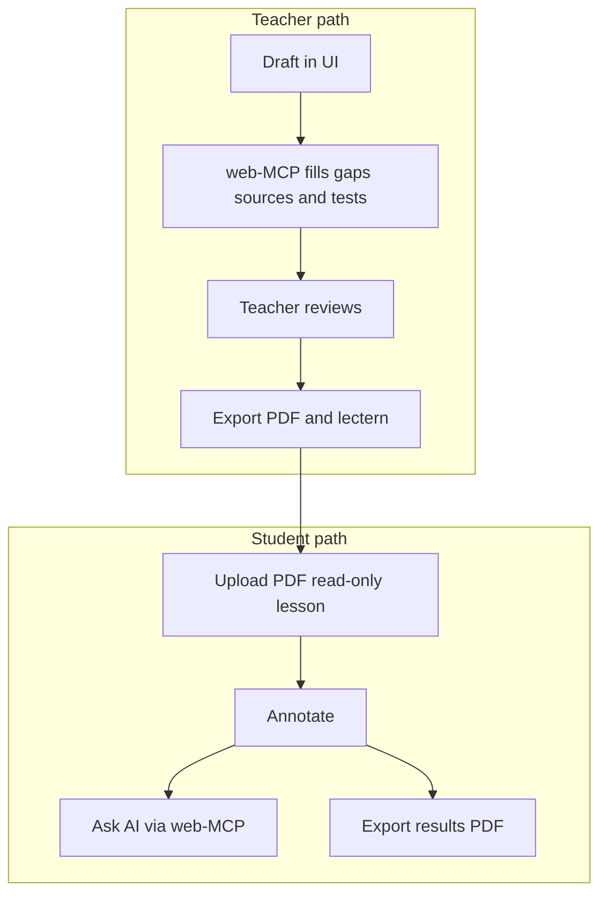
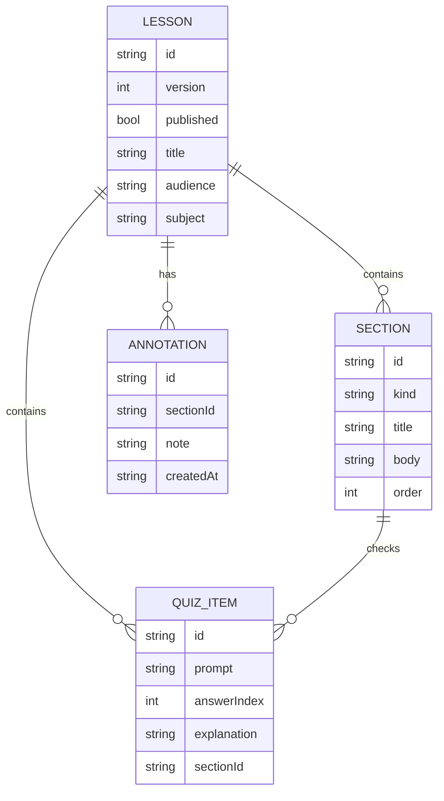
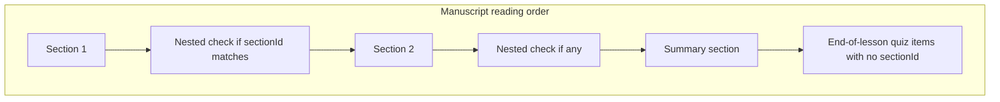
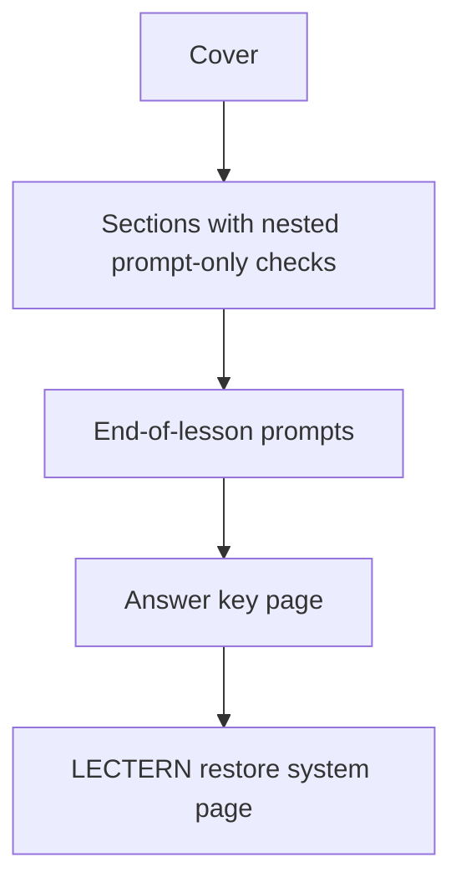
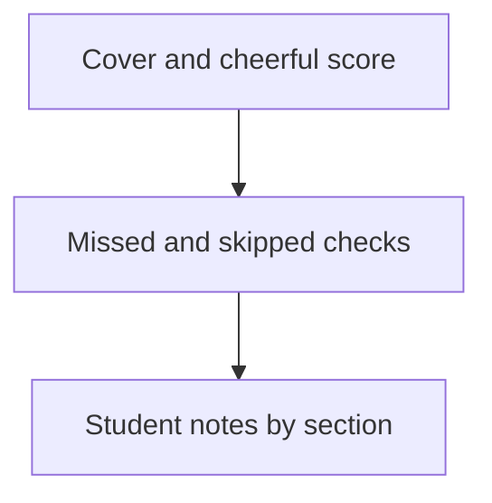
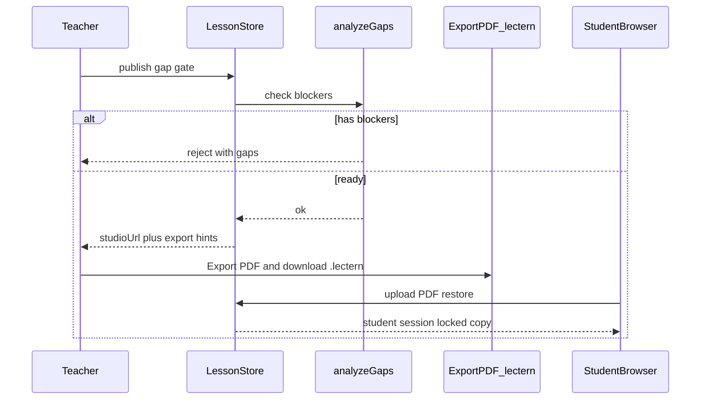
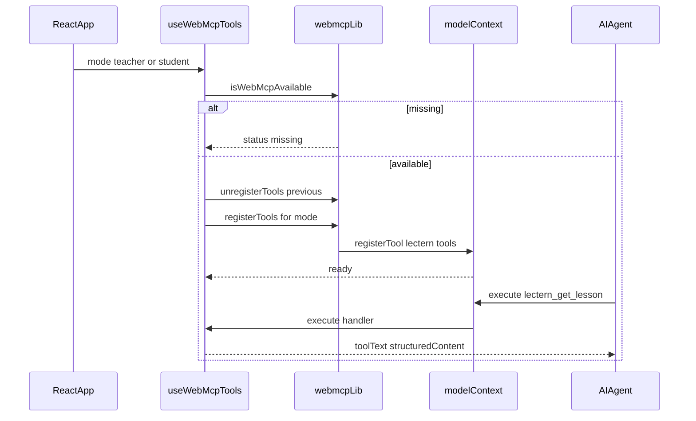
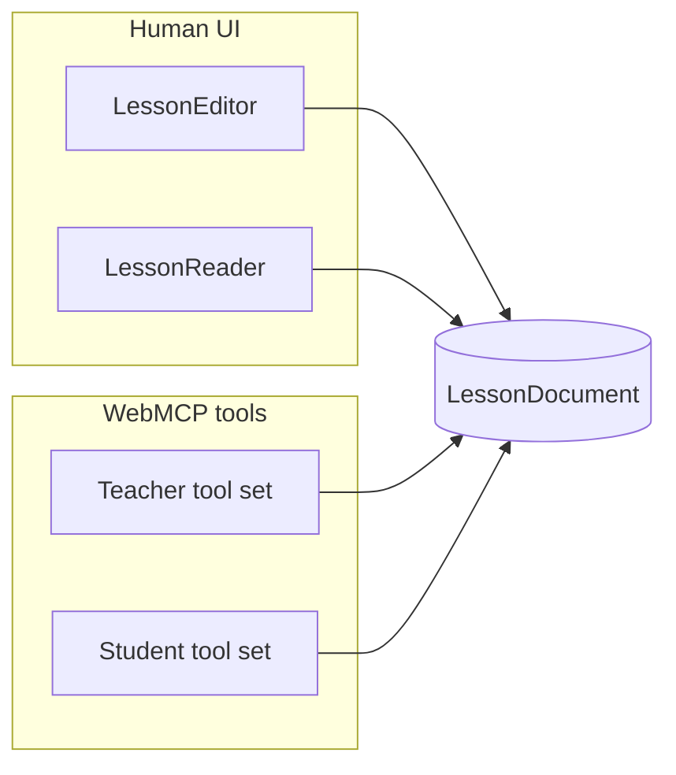
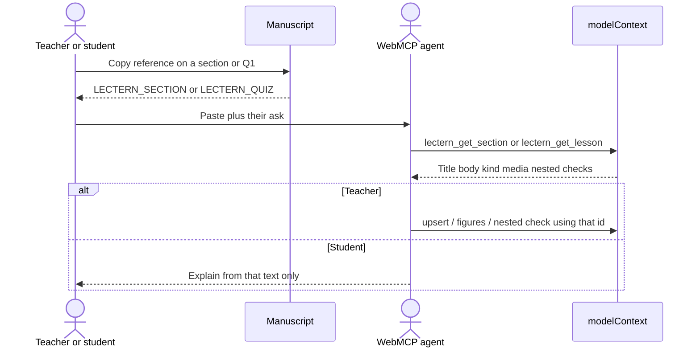
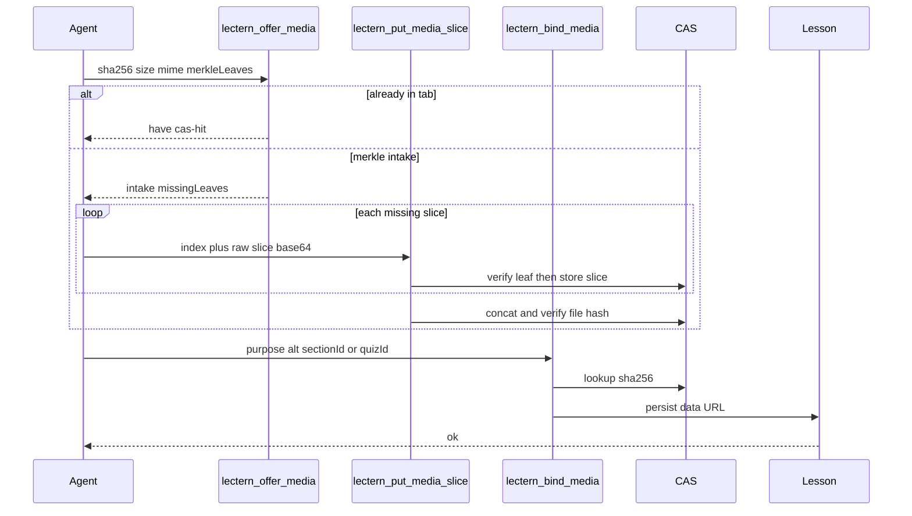

# Lectern — Feature Flows (Mermaid)

Companion diagrams for [C4-MODEL.md](./C4-MODEL.md), [webmcp.md](./webmcp.md), and [amdp.md](./amdp.md).

All diagrams use portable Mermaid syntax (`flowchart`, `sequenceDiagram`, `erDiagram`) for GitHub and common Markdown previews.

---

## End-to-end product flow

---

## Data model

Optional `sectionId` on a quiz item places a check after that section; omit it for the end-of-lesson block. Full rules: [section-checks.md](./section-checks.md).

---

## Manuscript reading order

Soft pause only — later sections stay readable. Student path is still read → annotate → quiz (no lock).

---

## PDF page stack

Prompt-only checks in the body; inverted striped answer key before the restore system page.

---

## Student results PDF

Printable handoff for the teacher (no restore payload). Full rules: [student-results-pdf.md](./student-results-pdf.md).

---

## Publish and share

Lesson data does not travel in a student URL. The studio URL stays `https://lectern.click/studio` (plus optional `?mode=` / `?demo=`). Teachers hand out a **PDF** for students and keep a **`.lectern`** file to reopen authoring.

Product flag: `ALLOW_PDF_RESTORE_AUTHORING` in `src/lib/product-flags.ts` (default **false**). When false, PDF / LCT1 restore opens student mode only; switching to Teacher shows this device’s draft or an empty page — never the PDF lesson. Flip the flag to restore legacy “PDF can reopen authoring.”

`.lectern` upload opens Teacher. PDF restore leaves the authoring tab.

---

## WebMCP registration lifecycle

---

## Dual UI vs dual tools

One document, two affordances — that is the WebMCP leverage for Lectern.

---

## Copy reference → grounded tool call

Each material has **Copy reference** (same `⎘` control as Copy the agent prompt). The clipboard holds a `LECTERN_SECTION` pointer, not the section body.

See [webmcp.md](./webmcp.md#copy-section-reference).

---

## AMDP cite → intake → bind

Photographs and video do not ride in the model’s JSON. The agent cites a SHA-256; the tab fills CAS; bind writes a data URL onto the lesson (PDF draw + LCT1). Full protocol: [amdp.md](./amdp.md), spec [AMDP/1](./AMDP-PROTOCOL.md).

json-chunk (`begin` / `append` / `commit`) is rank 4 — the same bind surface when earlier ranks failed or Merkle leaves are absent. Try cas-hit → plane-put → merkle-slice → json-chunk until CAS present, then STOP.

Chrome MCP plane-put (rank 2, when the agent already has a file on disk): stage in OS temp (`%TEMP%` / `$TMPDIR`), create a temporary `<input type="file">` on the page, append it to `document.body`, and leave it there (Lectern hides it visually). Upload that temp file. The page plane-puts on `change`; then status/re-offer until `have`, then bind. Optional: in-page `arrayBuffer()` → `window.__lecternAmdp.put`. Do not use a section Attach-media picker. Do not upload from the workspace path. Do not pass base64 as `evaluate_script.args`. If `DOM.setFileInputFiles` is denied or files stay empty, go to merkle-slice, then json-chunk, until present — then STOP. Mechanism: [Generated staging input](./amdp.md#generated-staging-input-plane-put).
