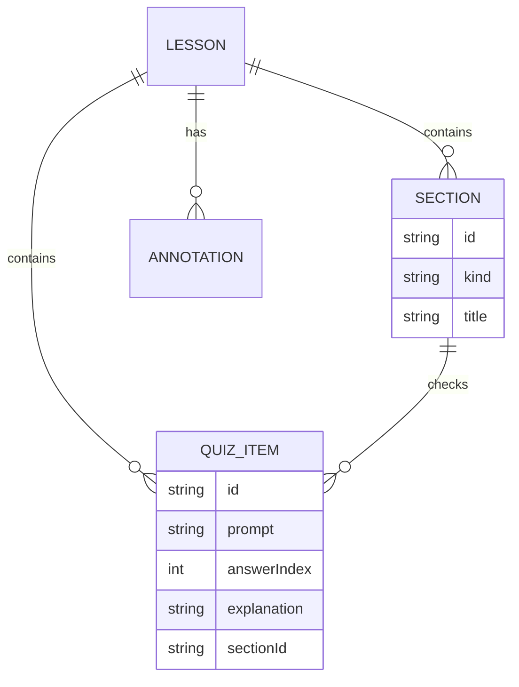
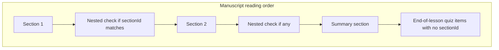
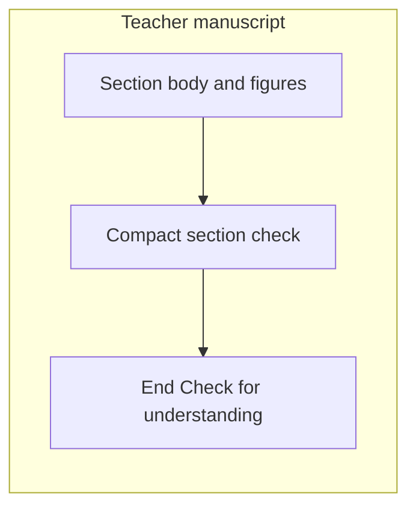
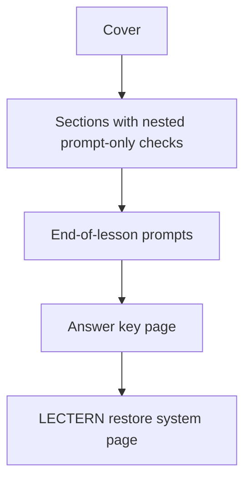

# Lectern — Nested section checks

Source of truth for **checks between chapters**: a quiz item may sit after a section so the learner proves that idea before the next one starts — without replacing the end-of-lesson quiz.

Companion diagrams also live in [flows.md](./flows.md) and agent loops in [webmcp.md](./webmcp.md).

---

## Problem

Today every check lives in `LessonDocument.quiz` and renders once at the end of the manuscript. Teachers want a soft pause after a section: prove the last idea, then continue. Paper exports need an answer key that cannot be glanced at while working (inverted textbook convention).

---

## Product decisions (locked)

| Decision | Choice |
| --- | --- |
| Student gating | **Soft pause only.** Later sections stay fully readable (scroll, print, PDF, `lectern_get_section`). No collapse, no correct-answer lock. |
| Completeness | **Optional.** Nested checks are a placement option. An end-of-lesson quiz still satisfies the existing `quiz` warning. **No new publish blocker.** |
| Storage | Optional `sectionId` on `QuizItem`. Do **not** nest `quiz[]` inside sections. |
| WebMCP | Extend `lectern_upsert_quiz_item` with optional `sectionId`. No extra tool for nested checks. |
| Digital answers | In-session React state (same as today). Not stored on the document. |
| Print answers | Dedicated answer-key page: upright title, **180° rotated** striped body. |

### Non-goals

- Hard / attempt gates that hide later sections
- Student results export page (see [student-results-pdf.md](./student-results-pdf.md))
- New WebMCP tool
- New section `kind`
- Storage version bump (`lectern.lesson.v1` stays)
- Rewriting demo lessons to use nested checks (demos may stay lesson-level)

---

## Data model

Keep one flat `lesson.quiz` array. Placement is optional:

```ts
interface QuizItem {
  id: string;
  prompt: string;
  choices: string[];
  choiceMedia?: Array<SectionMedia | null>;
  answerIndex: number;
  explanation: string;
  order: number;
  /** When set to a known section id, render after that section. Omit for end-of-lesson. */
  sectionId?: string;
}
```



### Helpers (domain)

| Helper | Behavior |
| --- | --- |
| `quizItemsForSection(lesson, sectionId)` | Items whose `sectionId` equals that id, sorted by `order`. |
| `lessonLevelQuiz(lesson)` | Items with missing/`null`/empty `sectionId`, **or** whose `sectionId` does not match any section (orphan → treat as lesson-level; **never drop**). Sorted by `order`. |
| `quizItemsInReadingOrder(lesson)` | For each section (by section `order`): that section’s nested items; then `lessonLevelQuiz`. Used by PDF prompts + answer key. |

### Compatibility

- Missing `sectionId` = current behavior. Restore packs, `.lectern` files, and `localStorage` need no version bump (legacy `?l=` share tokens still decode if bookmarked).
- `analyzeGaps` / `quiz_shape` still validate **all** items (nested and lesson-level). Invalid shape remains a **blocker**.
- `quiz` warning = zero items anywhere. Nested items count. No per-section warning.
- `removeSection` must cascade: delete annotations **and** quiz items with that `sectionId` (same as annotations today).
- On upsert: omit/empty `sectionId` → lesson-level; unknown section id → **reject** with a clear error (do not silently orphan on write).
- On load / read helpers: unknown `sectionId` → treat as lesson-level (do not drop).

---

## Reading order



Guidance (not enforced): prefer attaching checks to `material` / `example`; skip `summary` (end quiz is the synthesis).

---

## UI

Nested check is a **section footer**, not a second full “Check for understanding” chapter after every block.



| Placement | Chrome |
| --- | --- |
| Nested | Compact frame: short label (“Check this idea”), no end-quiz lede. Local Q1… numbering. |
| End of lesson | Existing `ManuscriptQuizFrame` + lede. Lists **only** `lessonLevelQuiz`. Local Q1… numbering again. |

- Reuse the same MC item chrome (`manuscript-quiz-item`, choice media, confirm-for-visuals).
- Teacher: “Add check” on the section → `upsertQuizItem` with that `sectionId`. End “Add quiz item” stays unscoped.
- Student: soft pause only — attempt/reveal in-session; later sections stay visible.
- Attention targets: `data-lectern-target="quiz:{id}"` on items; nested blocks also sit under `section:{id}`.

---

## WebMCP

Extend `lectern_upsert_quiz_item` with optional `sectionId` (omit for end-of-lesson). Nested checks did not add a tool; see [webmcp.md](./webmcp.md) for the current catalog.

| Tool | Change |
| --- | --- |
| `lectern_upsert_quiz_item` | Optional `sectionId` |
| `lectern_get_section` | Structured result includes that section’s nested quiz items |
| `lectern_get_lesson` | Quiz items may include `sectionId`; old agents ignore the field |
| `lectern_remove_quiz_item` | Unchanged (by quiz id) |

Attention (`resolveToolAttention`): when upsert/remove includes a `sectionId`, highlight `section:{id}` and `quiz:{quizId}` (and the `quiz` region) so the agent lands on the nested block, not only the end frame.

Teacher loop: after writing a section, optionally upsert a check with that section’s id.

Eval note: existing journeys stay valid (upsert without `sectionId`). Add one isolation prompt: “add a check after section `{id}`”.

---

## Gaps / publish

Unchanged severity:

- `quiz` — warning if `lesson.quiz.length === 0`
- `quiz_shape` — blocker if any item has invalid choices / answer index

No per-section completeness gap.

---

## PDF print

Today prompts print without answers. Nested placement and a paper key:

### Page stack



1. After each section, print that section’s **prompt-only** checks (choices + optional choice images).
2. Then print lesson-level prompts under “Check for understanding”.
3. Caption: prompts here; the key is on the last teaching page, printed upside down.
4. If any quiz items exist: `addPage()` for the answer key **before** the restore system page.

### Answer key page

- **Title upright** (e.g. “Answer key”) plus one upright line: turn the sheet around to read.
- **Answer body 180° rotated**, in **horizontal stripes** (alternating pale bands), one item per stripe.
- Stripe content: local question number (matching printed prompts), correct letter (A/B/C…), choice text, short explanation. **No** choice-media images on the key.
- Order = `quizItemsInReadingOrder` (nested by section, then lesson-level).
- Overflow → further inverted pages; only the first key page has the upright title.
- Footer and brand watermark stay upright.
- Restore attachment page stays **after** the key.

jsPDF: rotate the stripe body around the page center (graphics transform or `angle: 180` with origin correction). Do not rotate the title, footer, or watermark.

Digital Lectern is unchanged: students still reveal answers in the reader. Inversion is a **print** affordance.

---

## Implementation map

| Concern | Files |
| --- | --- |
| Types | `src/types/lesson.ts` |
| Helpers, gaps | `src/lib/lesson.ts` |
| Store mutations | `src/hooks/useLessonStore.ts` |
| WebMCP catalog / handlers | `src/lib/webmcp-catalog.ts`, `src/hooks/useWebMcpTools.ts` |
| Attention | `src/lib/agent-activity.ts` |
| Manuscript UI | `src/components/Manuscript.tsx`, `LessonEditor.tsx`, `LessonReader.tsx` |
| Styles | `src/styles/index.css` |
| i18n | `src/i18n/en.ts`, `src/i18n/locales/*` |
| PDF | `src/lib/export-pdf.ts` |
| Evals | `evals/cases/isolation-teacher.json`, `npm run eval:schema` |
| Deterministic tests | `scripts/test-webmcp-evals.ts` |

### Suggested order

1. Domain helpers + types + cascade + tests  
2. Store + WebMCP schema + attention + `eval:schema`  
3. UI + CSS + i18n (UTF-8)  
4. PDF interleaved prompts + inverted key  
5. Isolation fixture (keep demos lesson-level)  
6. `type-check`, `test`, browser + PDF verify  

If code and this doc disagree, **fix the code to match this doc**.
