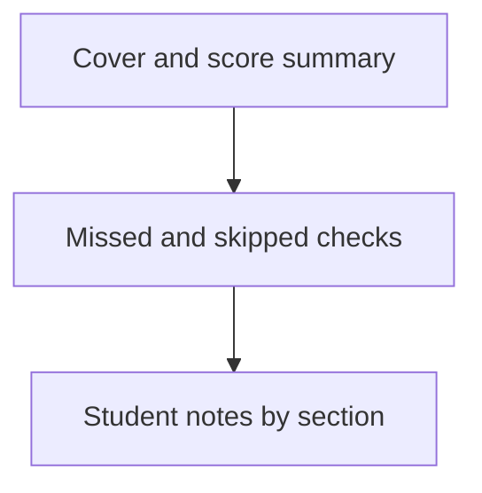

# Lectern — Student results PDF

Source of truth for the **async student→teacher handoff**: after studying, the learner downloads a printable sheet with score, skipped/missed checks, and notes — a document the teacher can use, not a screenshot of a chat.

Companion diagrams: [flows.md](./flows.md). Nested checks: [section-checks.md](./section-checks.md).

---

## Problem

Teachers and students collaborate asynchronously without accounts. Digital quiz answers lived only in React state; annotations stayed on the lesson but never left as a teacher-ready packet. Teachers need score, what was missed or skipped, and learner notes in one printable PDF.

---

## Product decisions (locked)

| Decision | Choice |
| --- | --- |
| Artifact | **Printable/emailable PDF only.** No results restore protocol; no teacher import of attempts into Lectern. |
| Export gate | **None.** Unanswered = **skipped**; wrong = **missed**. Export anytime from the bottom of student mode. |
| Score | `correct / total` over all checks (nested + end). Messaging always **encouraging** — mistakes are part of studying. |
| Module | Dedicated pipeline [`export-results-pdf.ts`](../../src/lib/export-results-pdf.ts), not bolted onto teacher lesson PDF. |
| WebMCP | **No new tool** in this slice (UI download only). |
| Storage | Attempts are **in-session only** (not on `LessonDocument`, not in share/restore). Notes come from existing `annotations[]`. |

### Non-goals

- Machine-readable results import / LCT1 for attempts
- Blocking export until every check is answered
- Persisting attempts on the lesson document or in `localStorage`
- New WebMCP tool
- Changing teacher lesson PDF / inverted answer key
- Lectern Cloud hosting of results

---

## Attempt model

```ts
type QuizAttemptStatus = 'unanswered' | 'correct' | 'incorrect';

interface QuizAttempt {
  quizItemId: string;
  choiceIndex: number | null; // null = skipped / unanswered
  status: QuizAttemptStatus;
}
```

Lifted into a parent map in `LessonReader` so nested and end-of-lesson checks share one attempt store for live summary + export.

Helpers in [`student-results.ts`](../../src/lib/student-results.ts):

| Helper | Role |
| --- | --- |
| `summarizeAttempts(lesson, attempts)` | Reading-order items with status; counts `correct`, `missed`, `skipped`, `total` |
| `cheerBand(summary)` | `perfect` \| `strong` \| `learning` \| `started` — never shaming |

---

## Cheerful tone

Always lead with encouragement **on the results PDF** (not shown in the live UI card). Band copy via i18n:

- **perfect** — celebrate mastery without pressure
- **strong** — strong progress; missed items are next practice
- **learning** — great that you tried; mistakes help it stick
- **started** — ready when you are; send what you have so far

Never: fail, poor, bad score, red-alert framing.

---

## Results PDF page stack



1. **Cover / summary** — Lesson title, optional student name, date, score fraction, cheerful banner.
2. **Missed and skipped** — Reading-order checks that were wrong or unanswered: prompt, student choice (or “Skipped”), correct choice. Nested vs end labeled lightly.
3. **Notes** — Annotations by section title (`learned` vs note). Empty: friendly line that they left no marks yet.
4. **Footer** — Lectern brand + “For your teacher” handoff line. **No** LCT1 restore, **No** inverted answer key.

Filename: `Lectern-results-<slug>-<date>.pdf`.

---

## UI

After the end quiz frame in student mode: “Send results to your teacher” card — optional name, primary download, one-line async explain, live soft summary (same cheer band as the PDF).

---

## Implementation map

| Area | Path |
| --- | --- |
| Spec | this document |
| Types / summarize | `src/lib/student-results.ts` |
| PDF | `src/lib/export-results-pdf.ts` |
| UI | `src/components/LessonReader.tsx` |
| Tests | `scripts/test-student-results.ts` |
