# Lectern x WebMCP — Feature Design

> **WebMCP is not an integration bolted on — it is the product.**  
> Lectern exposes a typed, mode-aware tool surface so teachers and students pair with an agent *inside* the same live document.

**Live URL:** [https://lectern.click](https://lectern.click)

---

## Why WebMCP (not chat-only, not DOM scraping)

| Approach | Problem | Lectern answer |
| --- | --- | --- |
| Paste lesson into chat | Context leaves the app; no shared UI | Agent calls tools on the open page |
| Agent clicks around the DOM | Fragile, slow, opaque | `registerTool` + JSON Schema inputs |
| Server MCP only | Needs backend + auth for demo | In-page WebMCP works on static HTTPS |

WebMCP turns Lectern into an **in-page MCP server**: tools wrap the same mutations the Teacher/Student UI uses.

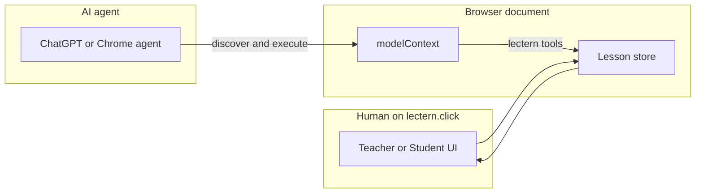

---

## How judges access WebMCP

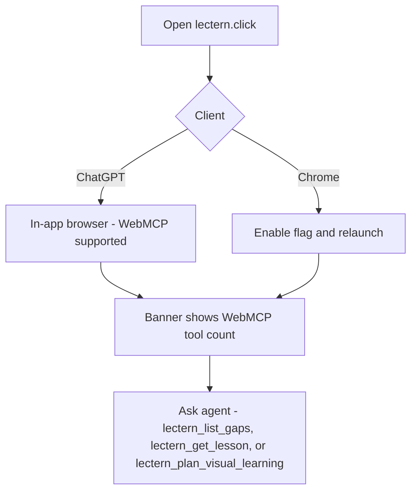

If WebMCP is missing, Lectern still runs as a human UI and shows setup instructions — but **hackathon judging expects the tool path.**

**Chrome MCP gotcha:** Opening Lectern in an isolated or automation Chrome window does **not** activate WebMCP. `navigator.modelContext` stays unavailable until `chrome://flags/#enable-webmcp-testing` is Enabled **and Chrome is relaunched**. A command-line flag alone does not enable it in current Chrome builds. If the default automation Chrome is locked by an existing Chrome process, use a separate profile, enable the flag in that profile, and relaunch that instance. Until `document.modelContext` or `navigator.modelContext` exists, Lectern tools (including `lectern_set_locale`) are not registered — do not scrape the page.

Detection order in code (`src/lib/webmcp.ts`):

1. `document.modelContext` (current W3C / Chrome direction)
2. `navigator.modelContext` (older examples)

---

## Mode-aware tool surface

Source of truth: `src/lib/webmcp-catalog.ts` (handlers in `useWebMcpTools.ts`). **42 unique tools.** They are **re-registered when mode changes** — teacher edit tools must not remain callable in student mode.

| Application state | Registered | Unregistered on purpose |
| --- | --- | --- |
| Teacher | **40** | annotation tools |
| Student | **12** | authoring, visuals, quiz, publish, library, restore-payload, restore/head |

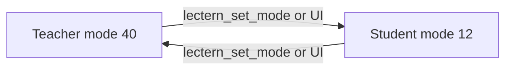

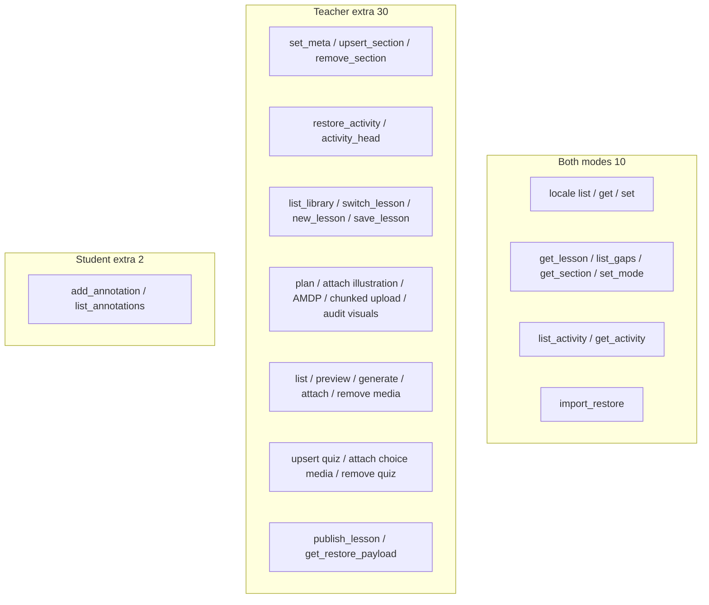

### Locale / chrome (both modes)

Does **not** translate lesson manuscript — only header, buttons, onboarding, co-pilot. Arabic (`ar`) switches the page to RTL. Russian is not supported.

| Tool | Purpose | Hint |
| --- | --- | --- |
| `lectern_list_locales` | List UI languages (flags in the header) | read-only |
| `lectern_get_locale` | Current locale, text direction, supported list | read-only |
| `lectern_set_locale` | Change chrome language (`en`, `es`, `pt-BR`, `zh-Hans`, `hi`, `ar`, `ja`, `ko`, `fr`, `de`, `uk`, `tr`, `vi`, `id`, `th`, `it`, `pl`) | write |

### Lesson document (both modes)

| Tool | Purpose | Hint |
| --- | --- | --- |
| `lectern_get_lesson` | Full document: meta, sections (`kind` included), quiz, gaps, mode, annotations | read-only |
| `lectern_list_gaps` | Completeness analysis (blockers + warnings) | read-only |
| `lectern_get_section` | One section by id, including its `kind` badge and any nested quiz items for that section. Accepts a pasted `LECTERN_SECTION` reference (Copy reference on each material) | read-only |
| `lectern_set_mode` | Switch `teacher` or `student` (triggers re-registration) | write |
| `lectern_import_restore` | Load from PDF restore pack, `LCT1.…`, legacy QR lines, or `.lectern` JSON | write |

### Save & load / Your materials (teacher)

Same panel as **Save & load lesson**. Do not scrape the list. Drafts live on this device (`localStorage` + IndexedDB). Switching persists the current lesson first (blank unused drafts are dropped).

| Tool | Purpose | Hint |
| --- | --- | --- |
| `lectern_list_library` | List **Your materials** plus demo cards, with the current id | read-only, unlogged |
| `lectern_switch_lesson` | Open a saved draft or a demo (`photosynthesis`, `webmcp`, `cossacks`) | write |
| `lectern_new_lesson` | Start blank; current stays under Your materials | write |
| `lectern_save_lesson` | Persist to Your materials and download `.lectern` | write |

### Co-pilot activity (both modes; restore is teacher)

Do not scrape the co-pilot panel. List/get do **not** add a card to the log.

| Tool | Purpose | Hint |
| --- | --- | --- |
| `lectern_list_activity` | Collapsed history, newest first (optional `limit`, max 100) | read-only, unlogged |
| `lectern_get_activity` | One card by `eventId`, including folded AMDP/json-chunk steps | read-only, unlogged |
| `lectern_restore_activity` | Check out that snapshot into the teacher manuscript (later cards stay) | teacher |
| `lectern_activity_head` | Leave checkout and return to the current (newest) snapshot | teacher |

### Authoring (teacher)

| Tool | Purpose | Hint |
| --- | --- | --- |
| `lectern_set_meta` | Title, audience, subject, learning objectives | write |
| `lectern_upsert_section` | Create/update a section (`kind`: material, example, summary, or a custom short label) | write |
| `lectern_remove_section` | Delete a section by id | write |

### Visual learning (teacher)

Pair an **AI raster illustration** (engagement, marked as generated) with an **SVG schematic** (explanation). Call the plan tool even when the teacher did not ask for art; audit before publish.

WebMCP execute is JSON, so a 30–80k character data URL often cannot travel in one tool call. **AMDP** (cite-then-bind) is the **default for every agent**. The copied landing prompt only points at `lectern_offer_media`; that tool’s description is the intake path. `lectern_offer_media` cites a SHA-256; if this tab already has the bytes, `lectern_bind_media` attaches with zero transfer. Then try every remaining intake rank until `lectern_media_status` present is true, then bind and STOP: plane-put, merkle-slice (`lectern_put_media_slice`), json-chunk (`begin` → `append` → `commit`). Do not skip a later rank after a failure. Bind/commit write a `data:` URL onto the lesson — the same bytes `embedLessonMedia` already puts into the exported PDF (drawn on the page) and into the LCT1 restore pack. Video is stored in LCT1 for restore; the printable PDF shows a caption. Do not keep agent media only in IndexedDB. Do not put pixels in chat JSON.

**Chrome MCP plane-put (rank 2):** Chrome’s file-upload tool often has no workspace roots and only allows the OS temp directory (`%TEMP%` / `$TMPDIR`). Stage the generated raster there — not the project path. Create a temporary `<input type="file">`, append it to `document.body`, and leave it there (Lectern hides it visually — do not pin a visible control). Upload that temp file. The page plane-puts on `change`; then `lectern_media_status` or re-offer until `have`, then `lectern_bind_media`. Optional: in-page `arrayBuffer()` → `window.__lecternAmdp.put`. Do not use a section Attach-media picker (teacher UI; skips bind). Never pass base64 through `evaluate_script.args`. If `DOM.setFileInputFiles` is denied or files stay empty, go to merkle-slice, then json-chunk, until present — then STOP. Mechanism: **[Generated staging input](./amdp.md#generated-staging-input-plane-put)**.

Diagrams, intake rank, and why this is the cutting-edge ACI: **[amdp.md](./amdp.md)** · spec **[AMDP/1](./AMDP-PROTOCOL.md)**.

| Tool | Purpose | Hint |
| --- | --- | --- |
| `lectern_plan_visual_learning` | ImageGen prompt + recommended SVG template for one section | read-only |
| `lectern_attach_generated_illustration` | Attach the generated raster; auto AI marker + transparency caption. Small URL/data URL only | write |
| `lectern_offer_media` | AMDP offer: cite sha256 (no pixels); returns have or intake | write |
| `lectern_put_media_slice` | AMDP merkle-slice intake | write |
| `lectern_compress_media` | Shrink a CAS raster on this page; bind the returned sha256 | write |
| `lectern_bind_media` | AMDP bind: attach a CAS hash onto the lesson | write |
| `lectern_media_status` | Whether this tab already has the hash | read-only |
| `lectern_begin_media_upload` | JSON-chunk fallback (`uploadId`, max 6000-char slices) | write |
| `lectern_append_media_chunk` | Append one base64 slice to that upload | write |
| `lectern_commit_media_upload` | Join slices into a data URL on the lesson (PDF draw + LCT1 restore) | write |
| `lectern_audit_visual_learning` | Check raster + schematic coverage; recommendations to fill gaps | read-only |

### Schematic / media (teacher)

30 Lectern-styled SVG templates (graph, cycle, compare, WebMCP bridge, `custom-svg`, animations). Prefer templates over remote blobs; public `/media` paths keep PDF restore packs small.

| Tool | Purpose | Hint |
| --- | --- | --- |
| `lectern_list_media_templates` | Catalog of 30 presets: id, params schema, `whenToUse` | read-only |
| `lectern_preview_media_template` | Render SVG `dataUrl` without attaching | read-only |
| `lectern_generate_section_media` | Render template + attach figure to a section | write |
| `lectern_attach_section_media` | Attach image/video by URL, `/path`, or data URL | write |
| `lectern_remove_section_media` | Remove an attached figure by media id | write |

### Quiz (teacher)

A complete lesson needs materials **and** tests. Checks may sit after a section (`sectionId`) or at the end of the lesson (omit `sectionId`). Soft pause only — see [section-checks.md](./section-checks.md). For concrete objects, follow creation with one `lectern_attach_quiz_choice_media` call per choice.

| Tool | Purpose | Hint |
| --- | --- | --- |
| `lectern_upsert_quiz_item` | Create/update multiple-choice check (prompt, choices, answer, explanation). Optional `sectionId` places the check after that section; omit for end-of-lesson. | write |
| `lectern_attach_quiz_choice_media` | Generated raster as a selectable visual answer card | write |
| `lectern_remove_quiz_item` | Delete a quiz item by id | write |

### Publish and restore (teacher)

| Tool | Purpose | Hint |
| --- | --- | --- |
| `lectern_publish_lesson` | Gap gate; returns studio URL + export hints (PDF for students, `.lectern` to keep writing) — **no student share token** | write |
| `lectern_get_restore_payload` | `LCT1.…` + `LECTERN_PDF/v1` blocks (same pack as exported PDF system pages) | read-only |

`lectern_import_restore` is shared (both modes). A `.lectern` file opens **teacher**. PDF / LCT1 opens **student** and does **not** reopen authoring (see `ALLOW_PDF_RESTORE_AUTHORING` in `src/lib/product-flags.ts`; default `false`).

### Student marks (student)

| Tool | Purpose | Hint |
| --- | --- | --- |
| `lectern_add_annotation` | Mark a section: `learned` or `note` (confusion / question / takeaway) | write |
| `lectern_list_annotations` | List all student marks on the current lesson | read-only |

### Index (all 41 names)

Teacher (39): `lectern_list_locales`, `lectern_get_locale`, `lectern_set_locale`, `lectern_get_lesson`, `lectern_list_gaps`, `lectern_list_activity`, `lectern_get_activity`, `lectern_get_section`, `lectern_set_mode`, `lectern_restore_activity`, `lectern_activity_head`, `lectern_set_meta`, `lectern_upsert_section`, `lectern_plan_visual_learning`, `lectern_attach_generated_illustration`, `lectern_begin_media_upload`, `lectern_append_media_chunk`, `lectern_commit_media_upload`, `lectern_offer_media`, `lectern_put_media_slice`, `lectern_bind_media`, `lectern_media_status`, `lectern_audit_visual_learning`, `lectern_list_media_templates`, `lectern_preview_media_template`, `lectern_generate_section_media`, `lectern_attach_section_media`, `lectern_remove_section_media`, `lectern_remove_section`, `lectern_upsert_quiz_item`, `lectern_attach_quiz_choice_media`, `lectern_remove_quiz_item`, `lectern_list_library`, `lectern_switch_lesson`, `lectern_new_lesson`, `lectern_save_lesson`, `lectern_publish_lesson`, `lectern_get_restore_payload`, `lectern_import_restore`.

Student (12): `lectern_list_locales`, `lectern_get_locale`, `lectern_set_locale`, `lectern_get_lesson`, `lectern_list_gaps`, `lectern_list_activity`, `lectern_get_activity`, `lectern_get_section`, `lectern_set_mode`, `lectern_import_restore`, `lectern_add_annotation`, `lectern_list_annotations`.

---

## Customer journey (WebMCP at every arrow)

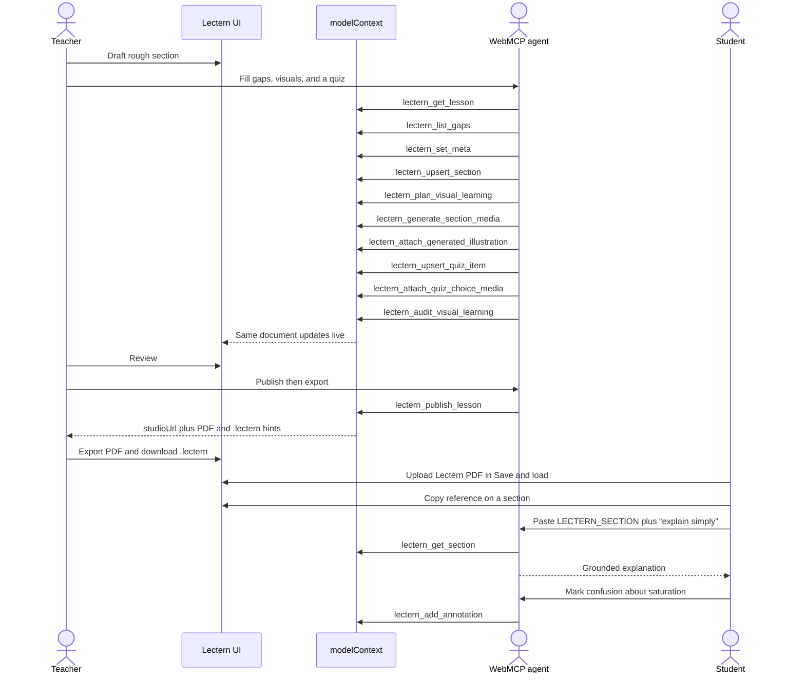

Pitch line:

> Lectern helps teachers share knowledge more efficiently with web-MCP AI.  
> Draft in UI → web-MCP fills gaps, sources, and builds tests → teacher reviews → export PDF / `.lectern`.  
> Students: upload PDF → read-only → annotate → ask AI (web-MCP).

Product rule: the teacher tab reopens from a `.lectern` file only. PDF is what you print and hand out. Restore-from-PDF leaves authoring (`ALLOW_PDF_RESTORE_AUTHORING = false`).

---

## Copy reference

Each material and each check (Q1, Q2, …) has a **Copy reference** button in the same family as **Copy the agent prompt** (`⎘` / copied `✓`).

It does **not** dump the body into chat. It copies a short pointer the agent can parse, then read with WebMCP.

**Material**

```
LECTERN_SECTION
sectionId: sec_leaf01
title: Light reactions
kind: material
mode: student
lesson: Photosynthesis

Call lectern_get_section with this sectionId. …
```

**Check (Q1, Q2, …)** — teacher and student, nested after a section or at the end of the lesson:

```
LECTERN_QUIZ
quizId: quiz_q1
label: Q1
prompt: Which picture shows WebMCP?
sectionId: sec_leaf01
mode: student
lesson: WebMCP explained

Call lectern_get_section with this sectionId (nested check). …
```

| Who | What they paste | What the agent should do |
| --- | --- | --- |
| Teacher | Section reference + ask | `lectern_get_section`, then authoring tools on that `sectionId` after the teacher asks |
| Teacher | Nested Q-label (`sectionId` set) | `lectern_get_section`, then `lectern_upsert_quiz_item` with `id` = that `quizId` |
| Teacher | End-of-lesson Q-label (no `sectionId`) | `lectern_get_lesson`, then `lectern_upsert_quiz_item` with `id` = that `quizId` |
| Student | Section reference + ask | `lectern_get_section`, then explain from that text; `lectern_add_annotation` only if they ask |
| Student | Nested Q-label | `lectern_get_section`, coach without dumping the answer |
| Student | End-of-lesson Q-label | `lectern_get_lesson`, coach without dumping the answer |

Field names in the block stay English so any UI language still parses. Source: `src/lib/section-reference.ts`, button `src/components/CopySectionReferenceButton.tsx`.

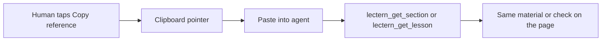

---

## Agent loops (recommended)

### Teacher hardening loop

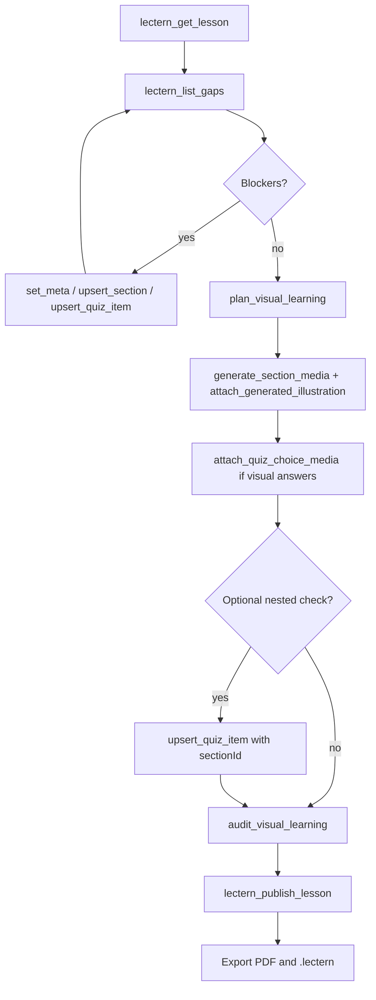

### Visual enrichment loop

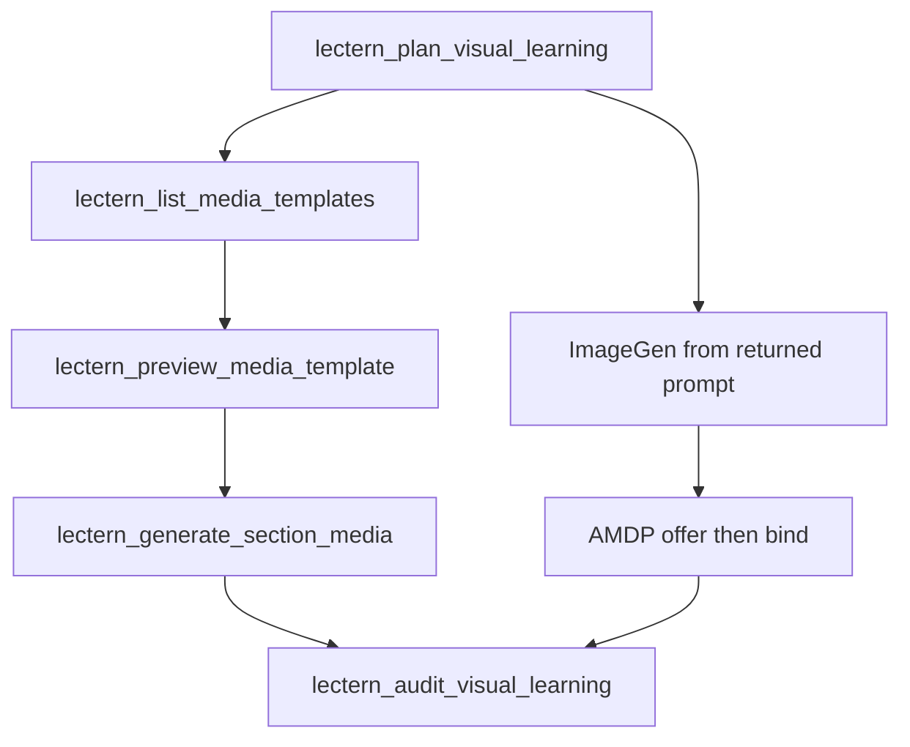

### PDF restore loop

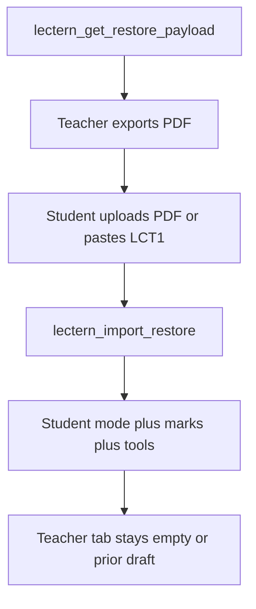

PDF restore does not reopen authoring unless `ALLOW_PDF_RESTORE_AUTHORING` is true. To keep writing, load a `.lectern` file.

### Your materials loop

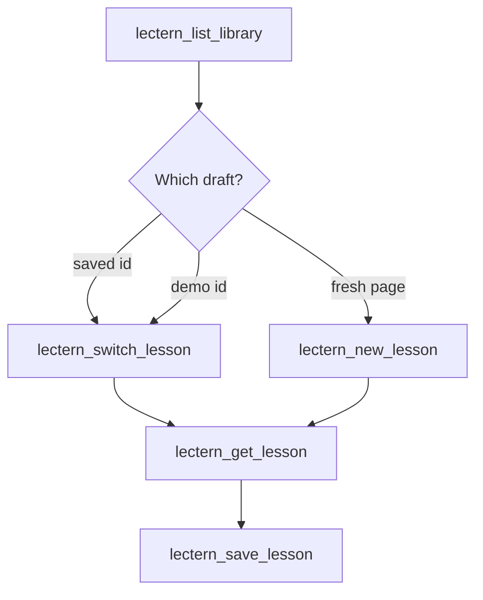

Do not scrape **Your materials**. List, then switch. Save downloads `.lectern` and keeps the draft on this device.

### Student grounding loop

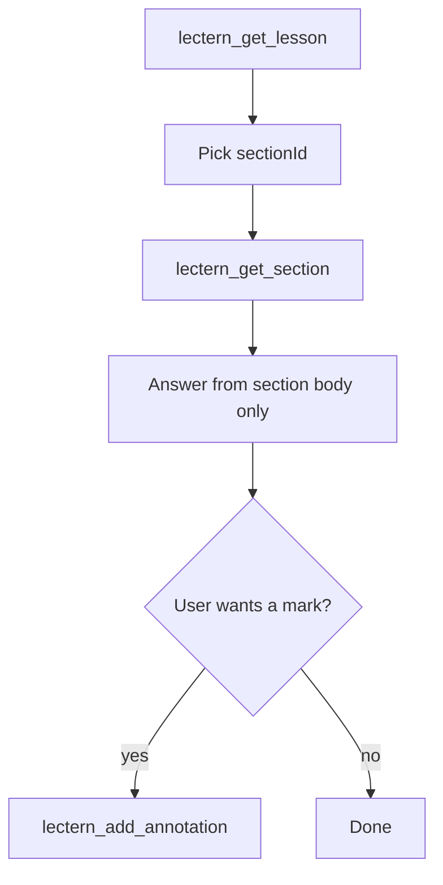

Teachers and students can skip “pick an id from `lectern_get_lesson`” by using **Copy reference** on a material. That copies a `LECTERN_SECTION` block with `sectionId`, title, kind, and mode. Paste it to the agent; the agent extracts `sectionId` and calls `lectern_get_section`.

**Prompt snippets** (also in README):

- Teacher: *Call `lectern_list_gaps` and fix every blocker.*
- Teacher: *Expand the opening section into textbook-quality prose, then add one quiz item.*
- Teacher: *After that section, add a check with `lectern_upsert_quiz_item` and `sectionId` set to the section id.*
- Teacher: *Plan visuals for that section, attach a generated illustration with AMDP (`lectern_offer_media` then `lectern_bind_media`), and generate the SVG schematic.*
- Teacher: *Attach generated image cards to each quiz choice (AMDP, not chat JSON).*
- Teacher: *Audit visual learning, then publish and tell me how to export the PDF for students.*
- Teacher: *Give me the PDF restore payload.*
- Teacher: *Save a .lectern so I can keep writing later.*
- Teacher: *List Your materials, then switch to that draft.*
- Teacher: *Start a new blank lesson and keep this one under Your materials.*
- Teacher: *Paste a Copy reference from a material, then expand that section on the page.*
- Teacher: *List co-pilot activity; restore the lesson from that card; return to current.*
- Student: *Read section `id` with `lectern_get_section` and explain it more simply.*
- Student: *Paste a Copy reference and explain that section more simply.*
- Student: *Add an annotation on that section: I am unsure about light saturation.*
- Either: *Switch the UI to Spanish with `lectern_set_locale`.*

---

## Tool result contract

Handlers return a normalized payload via `toolText()`:

- human-readable `text` / `content[]`
- machine-readable `structuredContent`

so both ChatGPT’s browser and Chrome WebMCP hosts can consume results.

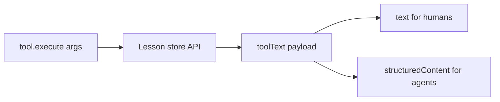

---

## Readiness model (gaps)

A lesson is publishable when blocker gaps are empty:

$$
\text{publishable} \iff B = 0
$$

Soft quality score (warnings discounted):

$$
Q = \frac{1}{1 + B + \tfrac{1}{2}W}
$$

`lectern_list_gaps` and `lectern_publish_lesson` share this logic (`analyzeGaps` / `isPublishable` in `src/lib/lesson.ts`).

---

## Evaluation pipeline

Lectern follows Chrome’s [Evals for WebMCP](https://developer.chrome.com/docs/ai/webmcp/evals). Full fixtures and commands: **[evals/README.md](../../evals/README.md)**.

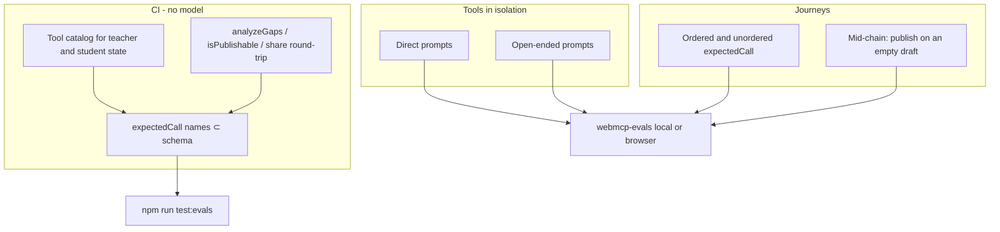

Before tools ship, evals check that an agent knows **when** to call a tool, **how** to fill arguments, and **what** a successful teacher/student journey looks like. Deterministic tests stay in CI; LLM evals are `npm run eval:local` / `eval:browser`.

---

## Implementation map

| Concern | File |
| --- | --- |
| `modelContext` detect / register / unregister | `src/lib/webmcp.ts` |
| Tool catalog (names, schemas, mode) — **41 tools** | `src/lib/webmcp-catalog.ts` |
| Tool execute + mode split | `src/hooks/useWebMcpTools.ts` |
| AMDP runtime (offer / bind / CAS; staging-input conceal + `change` put) | `src/lib/amdp/` + `src/lib/amdp-lectern.ts` · CSS in `src/styles/index.css` · [Generated staging input](./amdp.md#generated-staging-input-plane-put) |
| Chunked media upload (JSON-chunk fallback) | `src/lib/webmcp-media-upload.ts` |
| Types for WebMCP surface | `src/types/webmcp.ts` |
| Lesson mutations tools call | `src/hooks/useLessonStore.ts` |
| Visual plan / audit | `src/lib/visual-learning.ts` |
| Schematic templates (30) | `src/lib/media-templates/` |
| Section reference (Copy reference) | `src/lib/section-reference.ts`, `src/components/CopySectionReferenceButton.tsx` |
| PDF restore codec | `src/lib/restore-codec.ts`, `src/lib/pdf-restore-protocol.ts` |
| Locale chrome tools | `src/i18n/locales.ts` |
| WebMCP evals (teacher 40 / student 12 schemas) | `evals/` |
| Copy the agent prompt | `src/components/CopyAgentPromptButton.tsx` |
| Copy reference (per material) | `src/components/CopySectionReferenceButton.tsx` |
| Status banner for judges | `src/App.tsx` |

---

## Non-goals (MVP)

- Backend MCP transport / OAuth
- Server-side lesson database
- Automatic web research inside the page (the *agent* researches; tools write results into Lectern)
- Polyfill for browsers without WebMCP (detection + instructions only)

These keep the live URL judgeable in 10 days while still exercising WebMCP deeply.
